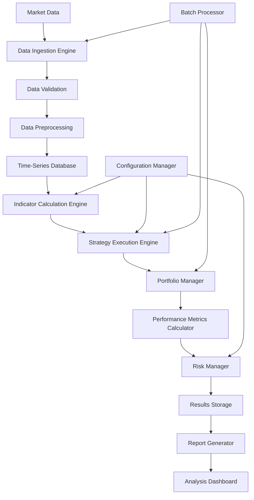
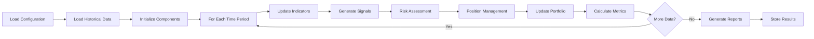
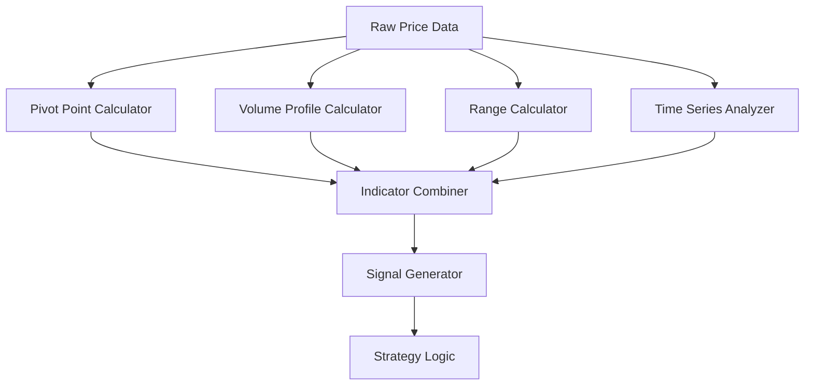

# Drummond Geometry Backtesting System Architecture

## Table of Contents
1. [System Overview](#system-overview)
2. [Core Architecture Components](#core-architecture-components)
3. [Historical Data Processing Pipeline](#historical-data-processing-pipeline)
4. [Indicator Calculation Engines](#indicator-calculation-engines)
5. [Strategy Implementation Framework](#strategy-implementation-framework)
6. [Portfolio Simulation & Position Management](#portfolio-simulation--position-management)
7. [Performance Metrics & Risk Management](#performance-metrics--risk-management)
8. [Report Generation System](#report-generation-system)
9. [Batch Processing Capabilities](#batch-processing-capabilities)
10. [Validation & Testing Framework](#validation--testing-framework)
11. [Results Storage & Analysis](#results-storage--analysis)
12. [Data Flow Diagrams](#data-flow-diagrams)
13. [Component Interactions](#component-interactions)
14. [Technical Specifications](#technical-specifications)

---

## System Overview

The Drummond Geometry Backtesting System is a comprehensive, modular architecture designed to rigorously test trading strategies based on Drummond Geometry principles. The system provides a robust framework for historical analysis, strategy validation, and performance optimization.

### Key Objectives
- **Accuracy**: Precise calculation of Drummond Geometry indicators and patterns
- **Performance**: Efficient processing of large historical datasets
- **Flexibility**: Configurable strategies and parameters for optimization
- **Reliability**: Comprehensive validation and testing framework
- **Scalability**: Batch processing capabilities for multiple symbols and timeframes

---

## Core Architecture Components

```
┌─────────────────────────────────────────────────────────────────┐
│                    Drummond Geometry Backtesting System        │
├─────────────────────────────────────────────────────────────────┤
│  Data Layer                                                      │
│  ├── Historical Data Manager                                    │
│  ├── Data Validators                                            │
│  └── Cache Management                                           │
│                                                                 │
│  Core Engine Layer                                              │
│  ├── Indicator Calculation Engine                              │
│  ├── Pattern Recognition Engine                                │
│  ├── Strategy Execution Engine                                 │
│  └── Portfolio Management Engine                               │
│                                                                 │
│  Analytics Layer                                                │
│  ├── Performance Metrics Calculator                           │
│  ├── Risk Management Module                                    │
│  ├── Statistical Analysis Tools                                │
│  └── Report Generation Engine                                  │
│                                                                 │
│  Control Layer                                                  │
│  ├── Configuration Manager                                     │
│  ├── Batch Processing Controller                               │
│  ├── Validation Framework                                      │
│  └── Results Storage Manager                                   │
└─────────────────────────────────────────────────────────────────┘
```

---

## Historical Data Processing Pipeline

### Architecture Overview
```
┌─────────────┐    ┌─────────────┐    ┌─────────────┐    ┌─────────────┐
│ Data Source │───▶│ Ingestion   │───▶│ Validation  │───▶│ Storage     │
│ (APIs/Files)│    │ Engine      │    │ Engine      │    │ Layer       │
└─────────────┘    └─────────────┘    └─────────────┘    └─────────────┘
                                              │
                                              ▼
┌─────────────┐    ┌─────────────┐    ┌─────────────┐    ┌─────────────┐
│ Cache Layer │◀───│ Preprocessing│◀───│ Quality     │◀───│ Data        │
│             │    │ Engine       │    │ Assurance   │    │ Enrichment  │
└─────────────┘    └─────────────┘    └─────────────┘    └─────────────┘
```

### Components

#### 1. Data Ingestion Engine
- **Multi-Source Support**: REST APIs, CSV files, databases, real-time feeds
- **Format Support**: OHLCV, tick data, fundamental data, sentiment data
- **Parallel Processing**: Concurrent data loading for multiple symbols
- **Error Handling**: Retry mechanisms and fallback sources

#### 2. Data Validation Engine
```python
class DataValidator:
    def validate_ohlcv(self, data):
        # Price continuity checks
        # Volume validation
        # Timestamp consistency
        # Missing data detection
        # Outlier identification
        
    def validate_drill_data(self, drill_data):
        # Time alignment validation
        # Price range verification
        # Completeness checks
```

#### 3. Data Preprocessing Engine
- **Gap Filling**: Linear interpolation for missing periods
- **Data Alignment**: Synchronize multiple timeframes
- **Feature Engineering**: Calculate derived indicators
- **Normalization**: Standardize data formats

#### 4. Storage Layer
- **Time-Series Database**: Optimized for financial data (InfluxDB, TimescaleDB)
- **Caching System**: Redis for frequently accessed data
- **Compression**: Efficient storage for large datasets
- **Indexing**: Fast retrieval by symbol and timeframe

---

## Indicator Calculation Engines

### Drummond Geometry Indicators Framework

#### 1. Pivot Point Calculator
```python
class PivotPointEngine:
    def calculate_daily_pivots(self, ohlc_data):
        """
        Calculate Standard and Fibonacci Pivot Points
        """
        high = ohlc_data['high'].iloc[-1]
        low = ohlc_data['low'].iloc[-1]
        close = ohlc_data['close'].iloc[-1]
        
        return {
            'pp': (high + low + close) / 3,
            'r1': 2 * pp - low,
            's1': 2 * pp - high,
            'r2': pp + (high - low),
            's2': pp - (high - low)
        }
```

#### 2. Weekly Range Calculator
```python
class WeeklyRangeEngine:
    def calculate_weekly_ranges(self, daily_data):
        """
        Calculate key weekly resistance/support levels
        """
        weekly_data = daily_data.resample('W').agg({
            'high': 'max',
            'low': 'min',
            'close': 'last'
        })
        
        return {
            'weekly_high': weekly_data['high'].iloc[-1],
            'weekly_low': weekly_data['low'].iloc[-1],
            'weekly_range': weekly_data['high'].iloc[-1] - weekly_data['low'].iloc[-1]
        }
```

#### 3. Volume Profile Engine
```python
class VolumeProfileEngine:
    def calculate_volume_profile(self, price_data, volume_data):
        """
        Calculate Point of Control (POC) and Value Area
        """
        price_volume_pairs = list(zip(price_data, volume_data))
        
        # Sort by price and calculate cumulative volume
        sorted_pairs = sorted(price_volume_pairs, key=lambda x: x[0])
        
        return {
            'poc': self.find_point_of_control(sorted_pairs),
            'value_area_high': self.calculate_value_area_high(sorted_pairs),
            'value_area_low': self.calculate_value_area_low(sorted_pairs)
        }
```

#### 4. Time Series Decomposition Engine
```python
class TimeSeriesEngine:
    def decompose_time_series(self, price_data):
        """
        Calculate time-based support and resistance levels
        """
        # Intraday patterns
        # Daily cycles
        # Weekly patterns
        # Monthly trends
        
    def calculate_trend_lines(self, price_data):
        """
        Calculate dynamic support and resistance lines
        """
        # Linear regression for trend identification
        # Moving average envelopes
        # Bollinger Band integration
```

### Performance Optimizations
- **Vectorized Calculations**: NumPy/Pandas optimization
- **Parallel Processing**: Multi-core indicator calculation
- **Caching**: Store frequently calculated values
- **Incremental Updates**: Update only changed data points

---

## Strategy Implementation Framework

### Strategy Architecture
```
┌─────────────────┐    ┌─────────────────┐    ┌─────────────────┐
│ Strategy Base   │───▶│ Indicator       │───▶│ Signal          │
│ Class           │    │ Integration     │    │ Generation      │
└─────────────────┘    └─────────────────┘    └─────────────────┘
         │                       │                       │
         ▼                       ▼                       ▼
┌─────────────────┐    ┌─────────────────┐    ┌─────────────────┐
│ Parameter       │    │ Risk Management │    │ Order           │
│ Configuration   │    │ Integration     │    │ Execution       │
└─────────────────┘    └─────────────────┘    └─────────────────┘
```

### Base Strategy Framework
```python
class DrummondGeometryStrategy:
    def __init__(self, config):
        self.config = config
        self.indicators = {
            'pivot_points': PivotPointEngine(),
            'weekly_range': WeeklyRangeEngine(),
            'volume_profile': VolumeProfileEngine(),
            'time_series': TimeSeriesEngine()
        }
        
    def generate_signals(self, market_data):
        """
        Main signal generation logic
        """
        signals = []
        
        # Calculate all indicators
        indicators_data = self.calculate_all_indicators(market_data)
        
        # Apply strategy logic
        entry_signals = self.identify_entries(indicators_data)
        exit_signals = self.identify_exits(indicators_data)
        
        return {
            'entries': entry_signals,
            'exits': exit_signals,
            'indicators': indicators_data
        }
        
    def calculate_all_indicators(self, market_data):
        """
        Calculate all required indicators for the strategy
        """
        return {
            'pivots': self.indicators['pivot_points'].calculate(market_data),
            'weekly_levels': self.indicators['weekly_range'].calculate(market_data),
            'volume_profile': self.indicators['volume_profile'].calculate(market_data),
            'time_patterns': self.indicators['time_series'].calculate(market_data)
        }
```

### Configurable Parameters
```yaml
strategy_config:
  entry_conditions:
    - price_vs_pivot_level: 0.618  # Fibonacci level
    - volume_confirmation: true
    - time_window: 2  # bars
    
  exit_conditions:
    - profit_target: 0.02  # 2%
    - stop_loss: 0.01      # 1%
    - time_exit: 10        # bars
    
  risk_management:
    - position_size: 0.02  # 2% of account
    - max_positions: 3
    - correlation_filter: 0.7
    
  indicators:
    pivot_points:
      enabled: true
      lookback_period: 20
    weekly_range:
      enabled: true
      confirmation_bars: 3
```

### Strategy Variants
1. **Breakout Strategy**: Enter on pivot level breaks
2. **Reversal Strategy**: Fade moves from key levels
3. **Range Strategy**: Trade within weekly range
4. **Trend Strategy**: Follow multi-timeframe trends

---

## Portfolio Simulation & Position Management

### Portfolio Engine Architecture
```
┌─────────────────────────────────────────────────────────────────┐
│                    Portfolio Manager                            │
├─────────────────────────────────────────────────────────────────┤
│  Position Tracker                                               │
│  ├── Open Positions                                             │
│  ├── Position History                                           │
│  └── P&L Calculation                                            │
│                                                                 │
│  Order Management                                               │
│  ├── Entry Orders                                               │
│  ├── Exit Orders                                                │
│  └── Order History                                              │
│                                                                 │
│  Risk Management                                                │
│  ├── Position Sizing                                            │
│  ├── Correlation Monitoring                                     │
│  └── Exposure Limits                                            │
└─────────────────────────────────────────────────────────────────┘
```

### Position Management System
```python
class PositionManager:
    def __init__(self, initial_capital=100000):
        self.initial_capital = initial_capital
        self.current_capital = initial_capital
        self.positions = {}
        self.order_history = []
        
    def process_signal(self, signal, market_data):
        """
        Process trading signals and manage positions
        """
        if signal['action'] == 'ENTRY':
            return self.open_position(signal, market_data)
        elif signal['action'] == 'EXIT':
            return self.close_position(signal, market_data)
            
    def open_position(self, signal, market_data):
        """
        Open new position with proper sizing
        """
        # Calculate position size based on risk
        position_size = self.calculate_position_size(signal)
        
        # Create position object
        position = {
            'symbol': signal['symbol'],
            'side': signal['side'],
            'size': position_size,
            'entry_price': market_data['close'],
            'entry_time': market_data['timestamp'],
            'stop_loss': signal.get('stop_loss'),
            'take_profit': signal.get('take_profit'),
            'strategy': signal['strategy']
        }
        
        self.positions[signal['symbol']] = position
        return position
        
    def close_position(self, signal, market_data):
        """
        Close existing position
        """
        if signal['symbol'] in self.positions:
            position = self.positions[signal['symbol']]
            
            # Calculate P&L
            if position['side'] == 'LONG':
                pnl = (market_data['close'] - position['entry_price']) * position['size']
            else:
                pnl = (position['entry_price'] - market_data['close']) * position['size']
                
            # Update capital
            self.current_capital += pnl
            
            # Record closed position
            closed_position = {
                **position,
                'exit_price': market_data['close'],
                'exit_time': market_data['timestamp'],
                'pnl': pnl,
                'return': pnl / (position['entry_price'] * position['size'])
            }
            
            del self.positions[signal['symbol']]
            return closed_position
```

### Order Execution Types
1. **Market Orders**: Immediate execution at current price
2. **Limit Orders**: Execute at specified price or better
3. **Stop Orders**: Triggered by stop price
4. **Bracket Orders**: Entry + stop loss + take profit

---

## Performance Metrics & Risk Management

### Performance Metrics Engine
```python
class PerformanceMetrics:
    def __init__(self, trades_list, equity_curve):
        self.trades = trades_list
        self.equity_curve = equity_curve
        
    def calculate_all_metrics(self):
        """
        Calculate comprehensive performance metrics
        """
        return {
            'returns': self.calculate_returns(),
            'risk_metrics': self.calculate_risk_metrics(),
            'trade_statistics': self.calculate_trade_statistics(),
            'drawdown_analysis': self.calculate_drawdown(),
            'benchmark_comparison': self.compare_to_benchmark()
        }
        
    def calculate_returns(self):
        """
        Calculate various return metrics
        """
        returns = {}
        
        # Total Return
        total_return = (self.equity_curve[-1] / self.equity_curve[0]) - 1
        returns['total_return'] = total_return
        
        # Annualized Return
        periods = len(self.equity_curve)
        years = periods / 252  # Assuming daily data
        returns['annualized_return'] = (1 + total_return) ** (1/years) - 1
        
        # Sharpe Ratio
        daily_returns = pd.Series(self.equity_curve).pct_change().dropna()
        returns['sharpe_ratio'] = daily_returns.mean() / daily_returns.std() * np.sqrt(252)
        
        # Sortino Ratio
        negative_returns = daily_returns[daily_returns < 0]
        downside_deviation = negative_returns.std() * np.sqrt(252)
        returns['sortino_ratio'] = daily_returns.mean() / downside_deviation if downside_deviation > 0 else 0
        
        # Calmar Ratio
        max_drawdown = self.calculate_max_drawdown()
        returns['calmar_ratio'] = returns['annualized_return'] / abs(max_drawdown)
        
        return returns
        
    def calculate_risk_metrics(self):
        """
        Calculate risk-related metrics
        """
        equity_series = pd.Series(self.equity_curve)
        
        return {
            'max_drawdown': self.calculate_max_drawdown(),
            'var_95': self.calculate_var(0.95),
            'cvar_95': self.calculate_cvar(0.95),
            'volatility': equity_series.pct_change().std() * np.sqrt(252),
            'beta': self.calculate_beta(),
            'correlation': self.calculate_correlation()
        }
        
    def calculate_trade_statistics(self):
        """
        Calculate trading-specific statistics
        """
        if not self.trades:
            return {}
            
        winning_trades = [t for t in self.trades if t['pnl'] > 0]
        losing_trades = [t for t in self.trades if t['pnl'] <= 0]
        
        return {
            'total_trades': len(self.trades),
            'winning_trades': len(winning_trades),
            'losing_trades': len(losing_trades),
            'win_rate': len(winning_trades) / len(self.trades) if self.trades else 0,
            'avg_win': np.mean([t['pnl'] for t in winning_trades]) if winning_trades else 0,
            'avg_loss': np.mean([t['pnl'] for t in losing_trades]) if losing_trades else 0,
            'profit_factor': abs(sum([t['pnl'] for t in winning_trades]) / 
                                sum([t['pnl'] for t in losing_trades])) if losing_trades else float('inf'),
            'largest_win': max([t['pnl'] for t in winning_trades]) if winning_trades else 0,
            'largest_loss': min([t['pnl'] for t in losing_trades]) if losing_trades else 0,
            'avg_trade_duration': self.calculate_avg_duration()
        }
```

### Risk Management Module
```python
class RiskManager:
    def __init__(self, config):
        self.config = config
        self.position_limits = config.get('position_limits', {})
        self.correlation_threshold = config.get('correlation_threshold', 0.7)
        
    def validate_position(self, new_position, existing_positions, market_data):
        """
        Validate if new position complies with risk rules
        """
        validation_results = {
            'approved': True,
            'reasons': [],
            'adjustments': {}
        }
        
        # Check position size limits
        if not self.check_position_size(new_position, existing_positions):
            validation_results['approved'] = False
            validation_results['reasons'].append('Position size exceeds limits')
            
        # Check correlation limits
        if not self.check_correlation_limits(new_position, existing_positions, market_data):
            validation_results['approved'] = False
            validation_results['reasons'].append('Correlation limits exceeded')
            
        # Check exposure limits
        if not self.check_exposure_limits(new_position, existing_positions):
            validation_results['approved'] = False
            validation_results['reasons'].append('Exposure limits exceeded')
            
        return validation_results
        
    def calculate_position_size(self, signal, account_value, risk_per_trade=0.02):
        """
        Calculate optimal position size based on risk management rules
        """
        # Kelly Criterion for position sizing
        win_rate = signal.get('win_rate', 0.5)
        avg_win = signal.get('avg_win', 1)
        avg_loss = signal.get('avg_loss', -1)
        
        if avg_loss == 0:
            return account_value * risk_per_trade
            
        kelly_fraction = (win_rate * avg_win - (1 - win_rate) * abs(avg_loss)) / avg_win
        kelly_fraction = max(0, min(kelly_fraction, 0.25))  # Cap at 25%
        
        # Adjust for volatility
        volatility_adjustment = self.calculate_volatility_adjustment(signal['symbol'])
        adjusted_kelly = kelly_fraction * volatility_adjustment
        
        position_size = account_value * adjusted_kelly
        max_position = account_value * self.position_limits.get('max_single_position', 0.1)
        
        return min(position_size, max_position)
```

---

## Report Generation System

### Report Architecture
```
┌─────────────────────────────────────────────────────────────────┐
│                  Report Generation Engine                       │
├─────────────────────────────────────────────────────────────────┤
│  Data Aggregator                                                │
│  ├── Performance Data                                           │
│  ├── Trade History                                              │
│  ├── Risk Metrics                                               │
│  └── Benchmark Data                                             │
│                                                                 │
│  Visualization Engine                                           │
│  ├── Equity Curves                                              │
│  ├── Drawdown Charts                                            │
│  ├── Trade Distribution                                         │
│  └── Monthly/Yearly Returns                                     │
│                                                                 │
│  Template Engine                                                │
│  ├── HTML Reports                                               │
│  ├── PDF Export                                                 │
│  ├── Interactive Dashboards                                     │
│  └── Executive Summary                                          │
└─────────────────────────────────────────────────────────────────┘
```

### Report Templates
```python
class ReportGenerator:
    def __init__(self, template_engine='jinja2'):
        self.template_engine = template_engine
        self.charts_engine = ChartsEngine()
        
    def generate_comprehensive_report(self, backtest_results):
        """
        Generate complete backtesting report
        """
        report_data = {
            'summary': self.create_executive_summary(backtest_results),
            'performance': self.create_performance_section(backtest_results),
            'risk_analysis': self.create_risk_section(backtest_results),
            'trade_analysis': self.create_trade_section(backtest_results),
            'charts': self.create_all_charts(backtest_results),
            'parameters': backtest_results['strategy_parameters']
        }
        
        return {
            'html_report': self.generate_html_report(report_data),
            'pdf_report': self.generate_pdf_report(report_data),
            'dashboard_data': self.create_dashboard_data(report_data)
        }
        
    def create_executive_summary(self, results):
        """
        Create high-level summary for executives
        """
        return {
            'total_return': f"{results['total_return']:.2%}",
            'annualized_return': f"{results['annualized_return']:.2%}",
            'sharpe_ratio': f"{results['sharpe_ratio']:.2f}",
            'max_drawdown': f"{results['max_drawdown']:.2%}",
            'win_rate': f"{results['win_rate']:.1%}",
            'total_trades': results['total_trades'],
            'profit_factor': f"{results['profit_factor']:.2f}"
        }
```

### Chart Generation
```python
class ChartsEngine:
    def create_equity_curve_chart(self, equity_data):
        """
        Create interactive equity curve chart
        """
        return {
            'type': 'line',
            'data': equity_data,
            'title': 'Equity Curve',
            'y_axis': 'Portfolio Value',
            'x_axis': 'Date'
        }
        
    def create_drawdown_chart(self, equity_data):
        """
        Create drawdown visualization
        """
        equity_series = pd.Series(equity_data)
        rolling_max = equity_series.expanding().max()
        drawdown = (equity_series - rolling_max) / rolling_max
        
        return {
            'type': 'area',
            'data': drawdown.values,
            'title': 'Drawdown Analysis',
            'y_axis': 'Drawdown %',
            'fill_color': 'red'
        }
        
    def create_monthly_returns_heatmap(self, returns_data):
        """
        Create monthly returns heatmap
        """
        returns_matrix = self.format_returns_matrix(returns_data)
        
        return {
            'type': 'heatmap',
            'data': returns_matrix,
            'title': 'Monthly Returns Heatmap',
            'color_scale': 'RdYlGn'
        }
```

---

## Batch Processing Capabilities

### Batch Processing Architecture
```
┌─────────────────────────────────────────────────────────────────┐
│                    Batch Processor                              │
├─────────────────────────────────────────────────────────────────┤
│  Job Queue Manager                                              │
│  ├── Priority Scheduling                                        │
│  ├── Resource Allocation                                        │
│  └── Progress Tracking                                          │
│                                                                 │
│  Multi-Symbol Processor                                         │
│  ├── Parallel Symbol Processing                                 │
│  ├── Symbol Group Management                                    │
│  └── Result Aggregation                                         │
│                                                                 │
│  Multi-Timeframe Processor                                      │
│  ├── Timeframe Coordination                                     │
│  ├── Data Synchronization                                       │
│  └── Cross-Timeframe Analysis                                   │
└─────────────────────────────────────────────────────────────────┘
```

### Configuration Management
```yaml
batch_config:
  symbols:
    - symbol_groups:
        major_fx: [EURUSD, GBPUSD, USDJPY, USDCHF]
        minor_fx: [EURGBP, EURJPY, GBPJPY, AUDUSD]
        commodities: [GOLD, SILVER, OIL, NATGAS]
        
  timeframes:
    - primary: 1H
    - secondary: 4H
    - tertiary: 1D
      
  optimization:
    parameters:
      - pivot_threshold: [0.5, 0.618, 0.786]
      - stop_loss: [0.01, 0.015, 0.02]
      - take_profit: [0.02, 0.03, 0.05]
      
  processing:
    max_concurrent_jobs: 8
    memory_limit_gb: 16
    timeout_hours: 24
```

### Batch Execution Engine
```python
class BatchProcessor:
    def __init__(self, config):
        self.config = config
        self.job_queue = PriorityQueue()
        self.worker_pool = ThreadPoolExecutor(max_workers=config['max_concurrent_jobs'])
        
    def submit_batch_job(self, batch_config):
        """
        Submit batch job for processing
        """
        job_id = self.generate_job_id()
        
        # Create individual jobs for each symbol/timeframe combination
        jobs = self.create_individual_jobs(batch_config)
        
        # Add jobs to queue with priorities
        for job in jobs:
            self.job_queue.put((job['priority'], job_id, job))
            
        # Start processing
        self.process_queue()
        
        return job_id
        
    def create_individual_jobs(self, batch_config):
        """
        Create individual backtest jobs
        """
        jobs = []
        
        for symbol_group in batch_config['symbols']:
            for timeframe in batch_config['timeframes']:
                for param_set in self.generate_parameter_combinations(batch_config):
                    job = {
                        'symbol_group': symbol_group,
                        'timeframe': timeframe,
                        'parameters': param_set,
                        'priority': self.calculate_priority(symbol_group, timeframe),
                        'estimated_duration': self.estimate_duration(symbol_group, timeframe)
                    }
                    jobs.append(job)
                    
        return sorted(jobs, key=lambda x: x['priority'])
```

---

## Validation & Testing Framework

### Testing Architecture
```
┌─────────────────────────────────────────────────────────────────┐
│                    Validation Framework                         │
├─────────────────────────────────────────────────────────────────┤
│  Unit Testing                                                   │
│  ├── Indicator Calculations                                     │
│  ├── Signal Generation                                          │
│  ├── Risk Management                                            │
│  └── Data Processing                                            │
│                                                                 │
│  Integration Testing                                            │
│  ├── End-to-End Workflows                                       │
│  ├── Multi-Component Integration                                │
│  └── Data Flow Validation                                       │
│                                                                 │
│  Performance Testing                                            │
│  ├── Speed Benchmarks                                           │
│  ├── Memory Usage                                               │
│  └── Scalability Testing                                        │
│                                                                 │
│  Statistical Validation                                         │
│  ├── Monte Carlo Analysis                                       │
│  ├── Walk-Forward Testing                                       │
│  └── Out-of-Sample Validation                                   │
└─────────────────────────────────────────────────────────────────┘
```

### Test Suite Implementation
```python
class BacktestingTestSuite:
    def __init__(self):
        self.test_data = self.load_test_data()
        self.expected_results = self.load_expected_results()
        
    def test_indicator_accuracy(self):
        """
        Test accuracy of indicator calculations
        """
        test_cases = [
            {
                'name': 'Pivot Points Calculation',
                'data': self.test_data['ohlc_sample'],
                'expected': self.expected_results['pivot_points'],
                'tolerance': 1e-6
            },
            {
                'name': 'Volume Profile Calculation',
                'data': self.test_data['volume_sample'],
                'expected': self.expected_results['volume_profile'],
                'tolerance': 1e-4
            }
        ]
        
        for test_case in test_cases:
            result = self.calculate_indicator(test_case['name'], test_case['data'])
            assert self.compare_results(result, test_case['expected'], test_case['tolerance'])
            
    def test_strategy_signal_generation(self):
        """
        Test strategy signal generation logic
        """
        strategy = DrummondGeometryStrategy(self.get_test_config())
        market_data = self.test_data['market_sample']
        
        signals = strategy.generate_signals(market_data)
        
        # Validate signal structure
        assert 'entries' in signals
        assert 'exits' in signals
        assert 'indicators' in signals
        
        # Validate signal logic
        for signal in signals['entries']:
            assert self.validate_signal_structure(signal)
            
    def test_portfolio_management(self):
        """
        Test portfolio and position management
        """
        portfolio = PortfolioManager(initial_capital=100000)
        
        # Test position opening
        position = portfolio.open_position('EURUSD', 'LONG', 10000, 1.1000)
        assert position['symbol'] == 'EURUSD'
        assert position['size'] == 10000
        
        # Test P&L calculation
        market_data = {'close': 1.1050, 'timestamp': '2023-01-02'}
        pnl = portfolio.update_position('EURUSD', market_data)
        assert pnl > 0  # Should be profitable
        
    def run_monte_carlo_analysis(self, strategy, market_data, num_simulations=1000):
        """
        Run Monte Carlo analysis for strategy validation
        """
        results = []
        
        for i in range(num_simulations):
            # Add random noise to market data
            perturbed_data = self.add_noise(market_data, noise_level=0.01)
            
            # Run strategy
            strategy_results = self.run_strategy(strategy, perturbed_data)
            results.append(strategy_results)
            
        # Analyze results
        return self.analyze_monte_carlo_results(results)
```

### Walk-Forward Testing
```python
class WalkForwardValidator:
    def __init__(self, lookback_period=252, forward_period=63):
        self.lookback_period = lookback_period  # 1 year of daily data
        self.forward_period = forward_period    # 3 months forward
        
    def run_walk_forward_analysis(self, strategy, market_data):
        """
        Perform walk-forward analysis
        """
        results = []
        
        start_idx = self.lookback_period
        while start_idx + self.forward_period < len(market_data):
            # Training period
            train_data = market_data.iloc[start_idx - self.lookback_period:start_idx]
            
            # Optimize strategy parameters on training data
            optimal_params = self.optimize_parameters(strategy, train_data)
            
            # Testing period
            test_data = market_data.iloc[start_idx:start_idx + self.forward_period]
            
            # Run strategy with optimal parameters on test data
            test_results = self.run_strategy_with_params(strategy, optimal_params, test_data)
            
            results.append({
                'period': (start_idx, start_idx + self.forward_period),
                'parameters': optimal_params,
                'results': test_results
            })
            
            start_idx += self.forward_period
            
        return self.aggregate_walk_forward_results(results)
```

---

## Results Storage & Analysis

### Data Storage Architecture
```
┌─────────────────────────────────────────────────────────────────┐
│                    Results Storage System                       │
├─────────────────────────────────────────────────────────────────┤
│  Database Layer                                                 │
│  ├── Time-Series Database (InfluxDB)                            │
│  ├── Relational Database (PostgreSQL)                          │
│  └── Document Database (MongoDB)                                │
│                                                                 │
│  File Storage                                                   │
│  ├── Data Exports                                               │
│  ├── Report Files                                               │
│  └── Configuration Snapshots                                    │
│                                                                 │
│  Analytics Storage                                              │
│  ├── Performance Metrics                                        │
│  ├── Risk Analytics                                             │
│  └── Optimization Results                                       │
└─────────────────────────────────────────────────────────────────┘
```

### Results Database Schema
```sql
-- Backtest Results Table
CREATE TABLE backtest_results (
    id UUID PRIMARY KEY,
    name VARCHAR(255) NOT NULL,
    strategy_config JSONB,
    symbol VARCHAR(10) NOT NULL,
    timeframe VARCHAR(10) NOT NULL,
    start_date DATE NOT NULL,
    end_date DATE NOT NULL,
    initial_capital DECIMAL(15,2),
    final_capital DECIMAL(15,2),
    total_return DECIMAL(10,4),
    annualized_return DECIMAL(10,4),
    sharpe_ratio DECIMAL(8,4),
    max_drawdown DECIMAL(8,4),
    win_rate DECIMAL(5,4),
    total_trades INTEGER,
    profit_factor DECIMAL(8,4),
    created_at TIMESTAMP DEFAULT NOW(),
    metadata JSONB
);

-- Individual Trades Table
CREATE TABLE trades (
    id UUID PRIMARY KEY,
    backtest_id UUID REFERENCES backtest_results(id),
    symbol VARCHAR(10) NOT NULL,
    side VARCHAR(4) NOT NULL, -- 'LONG' or 'SHORT'
    entry_time TIMESTAMP NOT NULL,
    exit_time TIMESTAMP NOT NULL,
    entry_price DECIMAL(10,5) NOT NULL,
    exit_price DECIMAL(10,5) NOT NULL,
    quantity DECIMAL(15,5) NOT NULL,
    pnl DECIMAL(15,2),
    pnl_pct DECIMAL(8,4),
    commission DECIMAL(8,2),
    strategy_signal VARCHAR(50),
    duration_hours INTEGER,
    INDEX idx_backtest_trades (backtest_id),
    INDEX idx_symbol_trades (symbol, entry_time)
);

-- Performance Metrics Table
CREATE TABLE performance_metrics (
    id UUID PRIMARY KEY,
    backtest_id UUID REFERENCES backtest_results(id),
    metric_name VARCHAR(50) NOT NULL,
    metric_value DECIMAL(15,6),
    metric_date DATE,
    additional_data JSONB
);
```

### Analysis Tools
```python
class ResultsAnalyzer:
    def __init__(self, database_connection):
        self.db = database_connection
        
    def compare_strategies(self, strategy_names, metrics=None):
        """
        Compare multiple strategies across various metrics
        """
        if metrics is None:
            metrics = ['total_return', 'sharpe_ratio', 'max_drawdown', 'win_rate']
            
        query = """
        SELECT name, strategy_config, symbol, timeframe, 
               total_return, annualized_return, sharpe_ratio, 
               max_drawdown, win_rate, total_trades, profit_factor
        FROM backtest_results 
        WHERE name = ANY(%s)
        ORDER BY sharpe_ratio DESC
        """
        
        results = self.db.execute(query, [strategy_names])
        
        # Create comparison DataFrame
        comparison_df = pd.DataFrame(results)
        
        # Generate comparison charts
        charts = {
            'returns_comparison': self.create_returns_chart(comparison_df),
            'risk_return_scatter': self.create_risk_return_scatter(comparison_df),
            'monthly_returns_heatmap': self.create_monthly_returns_heatmap(comparison_df)
        }
        
        return {
            'data': comparison_df,
            'charts': charts,
            'rankings': self.rank_strategies(comparison_df)
        }
        
    def optimize_parameters(self, base_config, optimization_ranges):
        """
        Perform parameter optimization analysis
        """
        # Generate parameter combinations
        param_combinations = self.generate_parameter_grid(optimization_ranges)
        
        results = []
        for params in param_combinations:
            # Run backtest with these parameters
            result = self.run_backtest_with_params(base_config, params)
            results.append({
                'parameters': params,
                'metrics': result['metrics'],
                'rank': 0  # Will be calculated later
            })
            
        # Rank results by Sharpe ratio
        results.sort(key=lambda x: x['metrics']['sharpe_ratio'], reverse=True)
        for i, result in enumerate(results):
            result['rank'] = i + 1
            
        return results
        
    def generate_optimization_report(self, optimization_results):
        """
        Generate comprehensive optimization report
        """
        return {
            'summary': self.create_optimization_summary(optimization_results),
            'sensitivity_analysis': self.analyze_parameter_sensitivity(optimization_results),
            'robustness_analysis': self.analyze_robustness(optimization_results),
            'recommendations': self.generate_recommendations(optimization_results)
        }
```

---

## Data Flow Diagrams

### Main Data Flow


### Backtest Execution Flow


### Indicator Calculation Flow


---

## Component Interactions

### Core Interaction Patterns

#### 1. Strategy-Indicator Interaction
```python
class StrategyIndicatorInterface:
    def __init__(self):
        self.indicators = {}
        self.cache = {}
        
    def get_indicator_data(self, indicator_name, market_data, **kwargs):
        """
        Retrieve indicator data with caching
        """
        cache_key = self.generate_cache_key(indicator_name, market_data, kwargs)
        
        if cache_key in self.cache:
            return self.cache[cache_key]
            
        if indicator_name not in self.indicators:
            raise ValueError(f"Unknown indicator: {indicator_name}")
            
        indicator = self.indicators[indicator_name]
        result = indicator.calculate(market_data, **kwargs)
        
        # Cache result
        self.cache[cache_key] = result
        return result
```

#### 2. Portfolio-Risk Management Interface
```python
class PortfolioRiskInterface:
    def __init__(self, portfolio_manager, risk_manager):
        self.portfolio = portfolio_manager
        self.risk_manager = risk_manager
        
    def validate_and_execute_trade(self, signal, market_data):
        """
        Coordinate between portfolio and risk management
        """
        # Get current positions
        current_positions = self.portfolio.get_all_positions()
        
        # Risk assessment
        risk_check = self.risk_manager.validate_position(
            signal, current_positions, market_data
        )
        
        if not risk_check['approved']:
            return {
                'executed': False,
                'reason': risk_check['reasons']
            }
            
        # Execute trade
        trade_result = self.portfolio.execute_trade(signal, market_data)
        
        # Update risk metrics
        self.risk_manager.update_portfolio_risk(
            trade_result, current_positions
        )
        
        return {
            'executed': True,
            'trade': trade_result,
            'risk_adjustments': risk_check.get('adjustments', {})
        }
```

#### 3. Data-Indicator Interface
```python
class DataIndicatorInterface:
    def __init__(self, data_manager):
        self.data_manager = data_manager
        
    def prepare_indicator_data(self, symbol, start_date, end_date, timeframes):
        """
        Prepare synchronized data for multiple timeframes
        """
        data = {}
        
        for timeframe in timeframes:
            # Get data for each timeframe
            raw_data = self.data_manager.get_historical_data(
                symbol, start_date, end_date, timeframe
            )
            
            # Validate and clean
            cleaned_data = self.validate_and_clean(raw_data)
            
            # Resample if needed
            resampled_data = self.resample_to_target_timeframe(
                cleaned_data, timeframe
            )
            
            data[timeframe] = resampled_data
            
        # Synchronize all timeframes
        synchronized_data = self.synchronize_timeframes(data)
        
        return synchronized_data
```

---

## Technical Specifications

### System Requirements

#### Hardware Specifications
- **CPU**: Multi-core processor (minimum 8 cores, recommended 16+ cores)
- **RAM**: 32GB minimum, 64GB recommended for large datasets
- **Storage**: 1TB NVMe SSD for data storage, 500GB for temporary processing
- **GPU**: Optional CUDA-capable GPU for accelerated calculations

#### Software Dependencies
```yaml
dependencies:
  core:
    - python: ">=3.8"
    - numpy: ">=1.20.0"
    - pandas: ">=1.3.0"
    - scipy: ">=1.7.0"
    
  database:
    - postgresql: ">=13.0"
    - influxdb: ">=2.0"
    - redis: ">=6.0"
    
  visualization:
    - plotly: ">=5.0.0"
    - matplotlib: ">=3.5.0"
    - seaborn: ">=0.11.0"
    
  parallel_processing:
    - joblib: ">=1.0.0"
    - dask: ">=2021.6.0"
    
  data_processing:
    - numba: ">=0.56.0"
    - cython: ">=0.29.0"
```

### Performance Specifications

#### Data Processing Performance
- **Data Ingestion**: 10,000+ bars/second for single symbol
- **Indicator Calculation**: 1,000+ bars/second for complex indicators
- **Strategy Execution**: 100+ signals/second
- **Portfolio Updates**: 1,000+ positions/second

#### Scalability Targets
- **Symbols**: Support 1,000+ symbols simultaneously
- **Timeframes**: 10+ different timeframes per symbol
- **Backtesting Period**: 10+ years of minute-level data
- **Concurrent Backtests**: 100+ parallel backtesting jobs

### Security Specifications

#### Data Security
- **Encryption**: AES-256 encryption for stored data
- **Access Control**: Role-based access control (RBAC)
- **Audit Logging**: Complete audit trail of all operations
- **Data Validation**: Input sanitization and validation

#### API Security
- **Authentication**: API key-based authentication
- **Rate Limiting**: Configurable rate limits per user
- **CORS**: Proper CORS configuration
- **HTTPS**: TLS 1.3 for all communications

### Monitoring and Logging

#### System Monitoring
```python
class SystemMonitor:
    def __init__(self):
        self.metrics_collector = MetricsCollector()
        self.alert_manager = AlertManager()
        
    def collect_performance_metrics(self):
        """
        Collect system performance metrics
        """
        return {
            'cpu_usage': psutil.cpu_percent(),
            'memory_usage': psutil.virtual_memory().percent,
            'disk_usage': psutil.disk_usage('/').percent,
            'network_io': psutil.net_io_counters(),
            'process_count': len(psutil.pids())
        }
        
    def monitor_backtest_progress(self, job_id):
        """
        Monitor backtest job progress
        """
        progress = self.get_job_progress(job_id)
        
        if progress['completion_percentage'] < 0.1:  # Less than 10%
            return
            
        # Check for performance anomalies
        if progress['estimated_completion_time'] > progress['deadline']:
            self.alert_manager.send_alert(
                f"Job {job_id} may miss deadline"
            )
```

#### Structured Logging
```python
import structlog

logger = structlog.get_logger()

class BacktestingLogger:
    def log_backtest_start(self, config):
        logger.info(
            "backtest_started",
            strategy=config['strategy_name'],
            symbols=config['symbols'],
            start_date=config['start_date'],
            end_date=config['end_date']
        )
        
    def log_trade_execution(self, trade):
        logger.info(
            "trade_executed",
            symbol=trade['symbol'],
            side=trade['side'],
            quantity=trade['quantity'],
            price=trade['price'],
            timestamp=trade['timestamp']
        )
        
    def log_performance_update(self, metrics):
        logger.info(
            "performance_update",
            total_return=metrics['total_return'],
            sharpe_ratio=metrics['sharpe_ratio'],
            max_drawdown=metrics['max_drawdown']
        )
```

---

## Implementation Roadmap

### Phase 1: Core Infrastructure (Weeks 1-4)
- [ ] Set up development environment and dependencies
- [ ] Implement data ingestion and validation pipeline
- [ ] Create basic indicator calculation engines
- [ ] Develop initial portfolio management system
- [ ] Set up database schema and storage layer

### Phase 2: Strategy Framework (Weeks 5-8)
- [ ] Build strategy base class and framework
- [ ] Implement Drummond Geometry indicators
- [ ] Create signal generation and risk management modules
- [ ] Develop position sizing and order execution logic
- [ ] Build performance metrics calculation engine

### Phase 3: Analysis and Reporting (Weeks 9-12)
- [ ] Create comprehensive reporting system
- [ ] Implement visualization and chart generation
- [ ] Build results storage and retrieval system
- [ ] Develop comparative analysis tools
- [ ] Create interactive dashboard interface

### Phase 4: Optimization and Scale (Weeks 13-16)
- [ ] Implement batch processing capabilities
- [ ] Add parameter optimization framework
- [ ] Create walk-forward and Monte Carlo analysis
- [ ] Build validation and testing framework
- [ ] Optimize performance for large-scale processing

### Phase 5: Production Readiness (Weeks 17-20)
- [ ] Comprehensive testing and debugging
- [ ] Performance tuning and optimization
- [ ] Documentation and user guides
- [ ] Deployment automation and monitoring
- [ ] Final validation and sign-off

---

## Conclusion

This comprehensive architecture provides a robust foundation for developing and testing Drummond Geometry-based trading strategies. The modular design ensures maintainability and extensibility, while the performance optimizations enable efficient processing of large datasets. The system is designed to scale from individual strategy testing to institutional-grade portfolio analysis and optimization.

The architecture emphasizes:
- **Accuracy**: Precise calculation of all Drummond Geometry components
- **Performance**: Optimized for speed and scalability
- **Flexibility**: Highly configurable and extensible framework
- **Reliability**: Comprehensive validation and testing
- **Usability**: Intuitive interfaces and comprehensive reporting

This system will enable traders and researchers to thoroughly validate Drummond Geometry strategies before live implementation, significantly reducing risk and improving the likelihood of success in live trading environments.