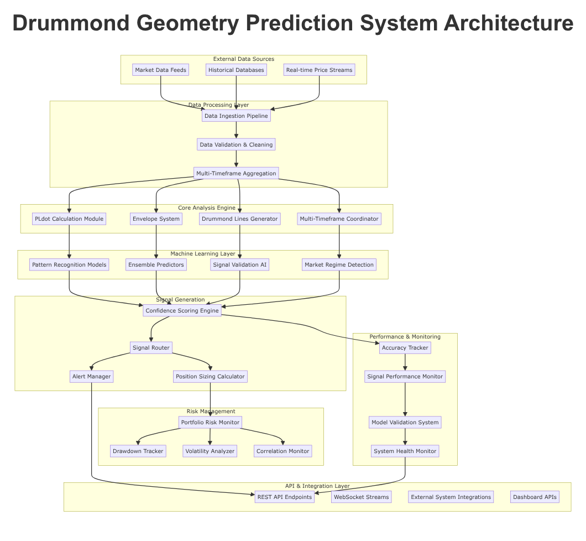
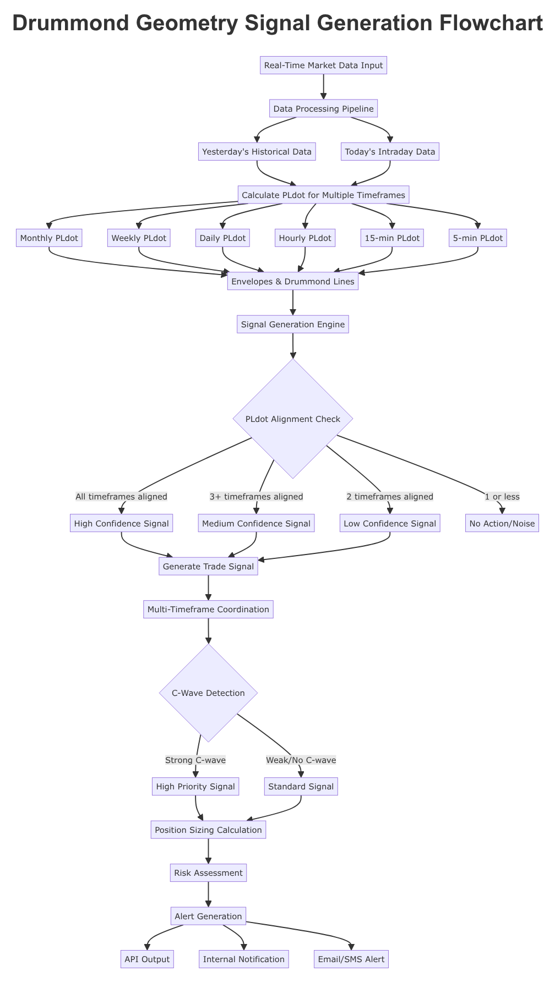
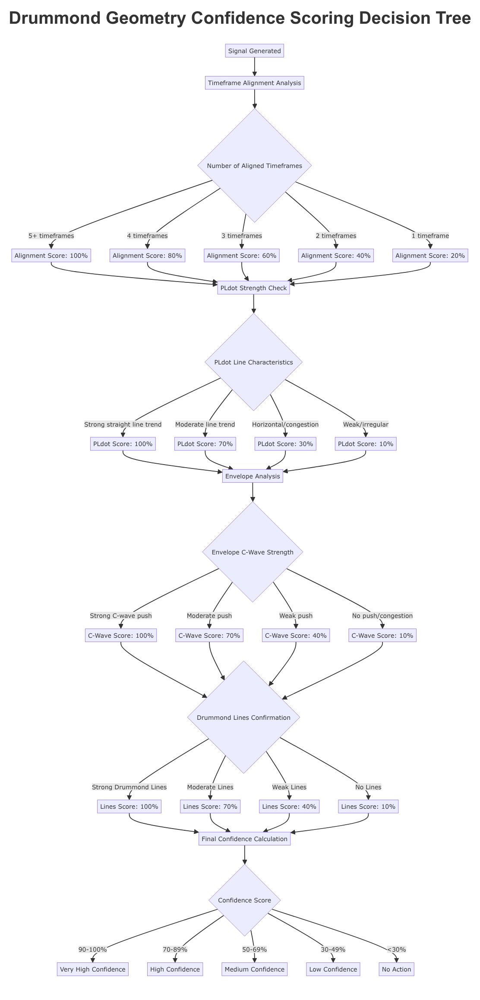

# Drummond Geometry Real-Time Prediction System Architecture

## Executive Summary

This document outlines the comprehensive architecture for a forward-looking prediction system designed specifically for Drummond Geometry real-time analysis. The system integrates multiple Drummond Geometry indicators with machine learning capabilities to generate high-confidence trading signals across multiple timeframes. Built on the foundation of Charles Drummond's 50-year research, the system provides traders with predictive support and resistance levels, confidence-scored trade recommendations, and comprehensive risk management tools.

The architecture encompasses real-time data processing, multi-timeframe coordination, machine learning pattern recognition, and robust API integration, enabling seamless deployment across various trading platforms and strategies.

## 1. System Overview

### 1.1 Core Philosophy

The Drummond Geometry Prediction System operates on the fundamental principle that markets exhibit geometric patterns that can be predicted and projected forward. Unlike traditional reactive analysis, this system provides forward-looking insights by:

- Calculating PLdot values for multiple timeframes simultaneously
- Projecting support and resistance areas into the future
- Coordinating signals across interconnected timeframes
- Generating confidence-scored recommendations based on geometric alignment
- Continuously learning and improving through machine learning integration

### 1.2 Key Components

The system architecture comprises eight major components:

1. **Real-Time Data Processing Pipeline** - Processes yesterday's completed data and today's live market data
2. **Signal Generation Engine** - Integrates all Drummond Geometry indicators for signal creation
3. **Confidence Scoring Algorithms** - Multi-factor analysis for trade recommendation quality
4. **Multi-Timeframe Coordination Logic** - Synchronizes signals across timeframes
5. **Alert and Notification System** - Real-time delivery of critical signals
6. **Machine Learning Integration** - Pattern recognition and predictive enhancement
7. **Risk Assessment and Position Sizing** - Portfolio-level risk management
8. **Performance Tracking and Model Validation** - Continuous improvement mechanisms



*Figure 1: Complete system architecture showing data flow from external sources through analysis layers to output interfaces*

## 2. Real-Time Data Processing Pipeline

### 2.1 Data Architecture

The data processing pipeline operates on a dual-timeline approach, processing both historical and real-time data streams:

#### Historical Data Processing (Yesterday's Data)
- **Completion Check**: Verify yesterday's market data completeness
- **PLdot Calculation**: Calculate final PLdot values for all timeframes
- **Trend Analysis**: Determine yesterday's trend vs. congestion status
- **Envelope Construction**: Build final envelope boundaries
- **Drummond Lines**: Draw and validate two-bar trendlines
- **Performance Metrics**: Calculate yesterday's signal accuracy

#### Real-Time Data Processing (Today's Data)
- **Tick Processing**: Process incoming price ticks in real-time
- **Bar Formation**: Update bar calculations as new data arrives
- **PLdot Updates**: Recalculate PLdot values with new data
- **Dynamic Adjustments**: Modify projections based on live data
- **Signal Monitoring**: Detect signal formation in real-time
- **Alert Generation**: Trigger immediate notifications for critical signals

### 2.2 Multi-Timeframe Data Synchronization

The system processes multiple timeframes simultaneously:

- **Primary Timeframes**: Monthly, Weekly, Daily, 4-Hour, 1-Hour
- **Secondary Timeframes**: 15-Minute, 5-Minute, 1-Minute
- **Custom Timeframes**: User-configurable intervals

Each timeframe maintains its own data processing pipeline while sharing computational resources for efficiency.

### 2.3 Data Quality Assurance

```python
class DataQualityMonitor:
    def validate_tick_data(self, tick_data):
        """Validate incoming tick data for accuracy and completeness"""
        checks = [
            self.check_timestamp_continuity(),
            self.validate_price_sequences(),
            self.verify_volume_consistency(),
            self.confirm_market_hours(),
            self.detect_outliers()
        ]
        return all(checks)
    
    def handle_data_gaps(self):
        """Detect and handle missing data intervals"""
        if self.detect_gap():
            if self.gap_duration < 5_minutes:
                return self.interpolate_missing_data()
            else:
                return self.mark_unreliable_period()
```

## 3. Signal Generation Engine

### 3.1 Core Drummond Geometry Indicators

The signal generation engine integrates all major Drummond Geometry components:

#### PLdot Calculation Module
```python
class PLdotCalculator:
    def __init__(self, timeframe):
        self.timeframe = timeframe
        
    def calculate_pldot(self, bar_data):
        """Calculate PLdot using Drummond's formula"""
        h1, l1, c1 = bar_data[-3]
        h2, l2, c2 = bar_data[-2]
        h3, l3, c3 = bar_data[-1]
        
        avg1 = (h1 + l1 + c1) / 3
        avg2 = (h2 + l2 + c2) / 3
        avg3 = (h3 + l3 + c3) / 3
        
        pldot = (avg1 + avg2 + avg3) / 3
        return pldot
    
    def project_forward(self, pldot_value):
        """Project PLdot value forward to next bar"""
        return self.horizontal_line_at_level(pldot_value)
```

#### Envelope System
```python
class EnvelopeSystem:
    def __init__(self, pldot_value, atr_multiplier=2.0):
        self.pldot = pldot_value
        self.multiplier = atr_multiplier
        self.atr = self.calculate_atr()
        
    def calculate_envelope_boundaries(self):
        """Calculate top and bottom envelope boundaries"""
        distance = self.atr * self.multiplier
        return {
            'top': self.pldot + distance,
            'bottom': self.pldot - distance
        }
    
    def detect_c_wave(self, price_action):
        """Detect C-wave formations for high-energy signals"""
        if price_action.is_above_envelope_top():
            return self.analyze_upward_c_wave()
        elif price_action.is_below_envelope_bottom():
            return self.analyze_downward_c_wave()
        return None
```

#### Drummond Lines Generator
```python
class DrummondLinesGenerator:
    def __init__(self):
        self.line_types = ['5-1', '5-2', '5-3', '5-9', '6-1', '6-5', '6-6', '6-7']
        
    def draw_two_bar_lines(self, bar1, bar2):
        """Draw all Drummond Lines for two-bar formation"""
        lines = {}
        for line_type in self.line_types:
            line = self.calculate_line_connection(bar1, bar2, line_type)
            lines[line_type] = self.project_line_forward(line)
        return lines
    
    def validate_line_strength(self, line):
        """Assess the strength and validity of Drummond Lines"""
        strength_factors = [
            self.check_line_recent_touches(),
            self.analyze_line_angle(),
            self.verify_line_projection_accuracy(),
            self.evaluate_timeframe_importance()
        ]
        return self.calculate_strength_score(strength_factors)
```

### 3.2 Signal Logic Flow



*Figure 2: Complete signal generation process from data input to final trade signal*

The signal generation follows this established workflow:

1. **Data Aggregation**: Combine PLdot, envelope, and Drummond Lines data
2. **Alignment Analysis**: Check for multi-timeframe alignment
3. **C-Wave Detection**: Identify high-energy market movements
4. **Signal Strength Assessment**: Evaluate overall signal quality
5. **Risk-Reward Analysis**: Calculate potential outcomes
6. **Final Signal Generation**: Create actionable trade recommendations

### 3.3 Signal Types and Classifications

#### Primary Signal Types
- **Support Bounce**: Price approaching significant PLdot support
- **Resistance Rejection**: Price approaching significant PLdot resistance  
- **Trend Continuation**: C-wave confirmation in trend direction
- **Trend Reversal**: Multi-timeframe alignment indicating reversal
- **Breakout**: Envelope boundary breakthrough with volume confirmation

#### Signal Classifications
- **Setup Signals**: Early indicators requiring confirmation
- **Execution Signals**: Ready-to-trade recommendations
- **Continuation Signals**: Trend-following opportunities
- **Exit Signals**: Profit-taking and stop-loss triggers

## 4. Confidence Scoring Algorithms

### 4.1 Multi-Factor Confidence Model



*Figure 3: Decision tree showing confidence scoring factors and their weightings*

The confidence scoring system evaluates signals across multiple dimensions:

#### Timeframe Alignment Score (Weight: 30%)
```python
def calculate_alignment_score(self, timeframes):
    """Score based on number of aligned timeframes"""
    aligned_count = sum(1 for tf in timeframes if tf.is_aligned())
    total_count = len(timeframes)
    
    if aligned_count >= 5:
        return 100  # Very High Confidence
    elif aligned_count == 4:
        return 80   # High Confidence
    elif aligned_count == 3:
        return 60   # Medium Confidence
    elif aligned_count == 2:
        return 40   # Low Confidence
    else:
        return 20   # Very Low Confidence
```

#### PLdot Strength Score (Weight: 25%)
```python
def calculate_pldot_strength(self, pldot_data):
    """Assess PLdot line quality and trend strength"""
    if pldot_data.is_straight_line():
        return 100  # Strong trend
    elif pldot_data.is_moderate_slope():
        return 70   # Moderate trend
    elif pldot_data.is_horizontal():
        return 30   # Congestion zone
    else:
        return 10   # Weak/irregular
```

#### C-Wave Strength Score (Weight: 20%)
```python
def calculate_cwave_score(self, envelope_data):
    """Score C-wave energy and directional push"""
    cwave = envelope_data.detect_cwave()
    if cwave.is_strong_push():
        return 100  # Strong C-wave
    elif cwave.is_moderate_push():
        return 70   # Moderate push
    elif cwave.is_weak_push():
        return 40   # Weak push
    else:
        return 10   # No push
```

#### Drummond Lines Score (Weight: 15%)
```python
def calculate_lines_score(self, drummond_lines):
    """Evaluate Drummond Lines confirmation"""
    if len(drummond_lines.strong_lines) >= 3:
        return 100  # Strong confirmation
    elif len(drummond_lines.strong_lines) >= 2:
        return 70   # Moderate confirmation
    elif len(drummond_lines.strong_lines) >= 1:
        return 40   # Weak confirmation
    else:
        return 10   # No confirmation
```

#### Historical Accuracy Score (Weight: 10%)
```python
def calculate_historical_score(self, symbol, signal_type):
    """Base score on historical performance of similar signals"""
    historical_data = self.get_historical_performance(symbol, signal_type)
    return historical_data.success_rate * 100
```

### 4.2 Final Confidence Calculation

```python
def calculate_final_confidence(self, signal):
    """Calculate weighted confidence score"""
    scores = {
        'alignment': self.calculate_alignment_score(signal.timeframes) * 0.30,
        'pldot': self.calculate_pldot_strength(signal.pldot_data) * 0.25,
        'cwave': self.calculate_cwave_score(signal.envelope_data) * 0.20,
        'lines': self.calculate_lines_score(signal.drummond_lines) * 0.15,
        'historical': self.calculate_historical_score(signal.symbol, signal.type) * 0.10
    }
    
    final_score = sum(scores.values())
    
    if final_score >= 90:
        return 'Very High Confidence', final_score
    elif final_score >= 70:
        return 'High Confidence', final_score
    elif final_score >= 50:
        return 'Medium Confidence', final_score
    elif final_score >= 30:
        return 'Low Confidence', final_score
    else:
        return 'No Action', final_score
```

## 5. Multi-Timeframe Coordination Logic

### 5.1 Timeframe Hierarchy

The system operates across six primary timeframes with defined hierarchy:

1. **Monthly (Primary)**: Long-term trend determination
2. **Weekly**: Intermediate trend and major support/resistance
3. **Daily**: Primary trading timeframe for swing trades
4. 4-Hour: Short-term trend confirmation
5. 1-Hour: Entry timing and minor adjustments
6. 15-Minute: Precise entry and exit points

### 5.2 Coordination Principles

#### Bottom-Up Response Pattern
Lower timeframes react first to higher timeframe support/resistance levels:

```python
class TimeframeCoordinator:
    def coordinate_timeframes(self):
        """Implement Drummond's bottom-up coordination principle"""
        monthly_support = self.get_monthly_pldot_support()
        weekly_reaction = self.analyze_weekly_reaction(monthly_support)
        daily_confirmation = self.analyze_daily_confirmation(weekly_reaction)
        entry_timing = self.determine_entry_timeframe(daily_confirmation)
        
        return {
            'entry_timeframe': entry_timing,
            'confidence_multiplier': self.calculate_coordination_strength()
        }
```

#### Signal Reinforcement Logic
Signals gain strength through multi-timeframe alignment:

```python
def assess_signal_reinforcement(self, signal):
    """Calculate signal strength through timeframe coordination"""
    coordination_matrix = {}
    
    for timeframe in self.get_active_timeframes():
        level = self.get_support_resistance_level(timeframe)
        reaction = self.analyze_price_reaction(level)
        coordination_matrix[timeframe] = reaction
    
    return self.calculate_reinforcement_score(coordination_matrix)
```

### 5.3 Signal Confirmation Workflow

1. **Higher Timeframe Analysis**: Identify key support/resistance levels
2. **Lower Timeframe Monitoring**: Watch for early reaction signals
3. **Alignment Detection**: Confirm timeframe coordination
4. **Entry Trigger**: Execute when all timeframes align
5. **Monitoring**: Track signal progression across timeframes

## 6. Alert and Notification System

### 6.1 Alert Categories

#### Critical Alerts (Immediate Action Required)
- **High Confidence Signals**: Score ≥ 80%
- **Multi-Timeframe Alignments**: 4+ timeframes aligned
- **Strong C-Wave Formations**: High energy thrust detected
- **Major Support/Resistance Breaks**: Significant level violations

#### Informational Alerts (Monitoring Recommended)
- **Medium Confidence Signals**: Score 50-79%
- **Setup Formations**: Early signal development
- **Timeframe Developments**: Changes in higher timeframe trends
- **Volatility Warnings**: Unusual market conditions

#### System Alerts (Technical Notifications)
- **Data Quality Issues**: Missing or unreliable data
- **Model Performance Changes**: Accuracy degradation alerts
- **System Health Status**: Technical maintenance notifications

### 6.2 Delivery Mechanisms

```python
class AlertManager:
    def __init__(self):
        self.delivery_channels = {
            'email': EmailNotifier(),
            'sms': SMSNotifier(),
            'webhook': WebhookNotifier(),
            'push': PushNotifier(),
            'dashboard': DashboardNotifier()
        }
    
    def send_alert(self, alert):
        """Route alert to appropriate delivery channels based on priority"""
        channels = self.determine_channels(alert.priority)
        for channel in channels:
            self.delivery_channels[channel].send(alert)
    
    def format_alert(self, signal):
        """Format alert with Drummond Geometry context"""
        return {
            'symbol': signal.symbol,
            'timeframe': signal.timeframe,
            'signal_type': signal.type,
            'confidence_score': signal.confidence_score,
            'key_levels': {
                'support': signal.pldot_level,
                'resistance': signal.envelope_top
            },
            'recommendation': self.generate_recommendation(signal),
            'risk_metrics': signal.risk_assessment
        }
```

### 6.3 Alert Customization

- **Threshold Configuration**: User-defined confidence score thresholds
- **Symbol Filtering**: Specific instruments to monitor
- **Timeframe Selection**: Alert frequency by timeframe
- **Delivery Preferences**: Customizable notification methods

## 7. Machine Learning Integration

### 7.1 Pattern Recognition Models

#### Historical Pattern Detection
```python
class PatternRecognitionML:
    def __init__(self):
        self.pattern_models = {
            'pldot_patterns': PatternModel('pldot_sequences'),
            'envelope_patterns': PatternModel('envelope_behaviors'),
            'coordination_patterns': PatternModel('timeframe_alignments'),
            'cwave_patterns': PatternModel('cwave_formations')
        }
    
    def train_pattern_models(self, historical_data):
        """Train ML models on historical Drummond Geometry patterns"""
        for model_name, model in self.pattern_models.items():
            training_data = self.extract_pattern_features(historical_data, model_name)
            model.train(training_data)
    
    def detect_pattern_match(self, current_data):
        """Identify similar historical patterns to current market state"""
        pattern_matches = {}
        for pattern_type, model in self.pattern_models.items():
            similarity_score = model.predict_similarity(current_data)
            if similarity_score > 0.8:  # High similarity threshold
                historical_outcome = model.get_historical_outcome(similarity_score)
                pattern_matches[pattern_type] = {
                    'similarity_score': similarity_score,
                    'historical_outcome': historical_outcome,
                    'confidence_adjustment': self.calculate_pattern_confidence(similarity_score)
                }
        return pattern_matches
```

#### Ensemble Prediction Models
```python
class EnsemblePredictor:
    def __init__(self):
        self.models = {
            'xgboost': XGBoostPredictor(),
            'random_forest': RandomForestPredictor(),
            'neural_network': NeuralNetworkPredictor(),
            'lstm': LSTMPredictor()
        }
        self.model_weights = self.initialize_weights()
    
    def generate_prediction(self, signal_features):
        """Generate ensemble prediction from multiple models"""
        predictions = {}
        for model_name, model in self.models.items():
            pred = model.predict(signal_features)
            predictions[model_name] = pred
        
        weighted_prediction = self.calculate_weighted_average(predictions)
        confidence_interval = self.calculate_prediction_confidence(predictions)
        
        return {
            'prediction': weighted_prediction,
            'confidence_interval': confidence_interval,
            'individual_predictions': predictions,
            'model_agreement': self.calculate_model_agreement(predictions)
        }
```

### 7.2 Adaptive Learning System

#### Online Learning Implementation
```python
class AdaptiveLearningSystem:
    def __init__(self):
        self.performance_tracker = SignalPerformanceTracker()
        self.model_updater = ModelUpdateScheduler()
        self.feature_selector = AdaptiveFeatureSelector()
    
    def update_models(self, signal_outcomes):
        """Continuously update models based on signal performance"""
        for outcome in signal_outcomes:
            if self.should_update_model(outcome):
                self.adjust_model_weights(outcome)
                self.update_feature_importance(outcome)
                self.retrain_with_new_data(outcome)
    
    def adapt_to_market_regime(self, market_conditions):
        """Adjust models for different market regimes"""
        current_regime = self.detect_market_regime(market_conditions)
        regime_specific_model = self.get_regime_model(current_regime)
        return regime_specific_model
```

### 7.3 Feature Engineering

#### Technical Feature Extraction
```python
class FeatureEngineer:
    def extract_drummond_features(self, market_data):
        """Extract features specific to Drummond Geometry methodology"""
        features = {
            'pldot_alignment_score': self.calculate_pldot_alignment(market_data),
            'envelope_violation_frequency': self.count_envelope_breaks(market_data),
            'cwave_strength_index': self.measure_cwave_energy(market_data),
            'drummond_lines_density': self.count_active_drumond_lines(market_data),
            'timeframe_coordination_score': self.assess_coordination_strength(market_data),
            'trend_congestion_ratio': self.calculate_trend_congestion_balance(market_data)
        }
        return self.normalize_features(features)
```

## 8. Risk Assessment and Position Sizing

### 8.1 Portfolio Risk Monitoring

#### Multi-Level Risk Framework
```python
class RiskAssessmentEngine:
    def __init__(self):
        self.risk_levels = {
            'position_level': PositionRiskCalculator(),
            'sector_level': SectorRiskCalculator(),
            'portfolio_level': PortfolioRiskCalculator()
        }
    
    def calculate_position_risk(self, signal, portfolio_context):
        """Calculate risk for individual position"""
        position_risk = {
            'drummond_risk_score': self.assess_drummond_geometry_risk(signal),
            'volatility_risk': self.measure_volatility_risk(signal.symbol),
            'correlation_risk': self.assess_correlation_risk(signal, portfolio_context),
            'liquidity_risk': self.evaluate_liquidity_risk(signal.symbol)
        }
        
        overall_risk = self.weight_risk_factors(position_risk)
        return {
            'risk_score': overall_risk,
            'recommended_position_size': self.calculate_position_size(overall_risk),
            'stop_loss_level': self.determine_stop_loss(signal),
            'take_profit_targets': self.calculate_profit_targets(signal)
        }
```

### 8.2 Position Sizing Algorithms

#### Kelly Criterion Integration
```python
class PositionSizer:
    def __init__(self):
        self.base_kelly_fraction = 0.25  # Conservative starting point
        self.max_position_size = 0.10    # Maximum 10% per position
        
    def calculate_position_size(self, signal, account_balance):
        """Calculate optimal position size using modified Kelly Criterion"""
        win_rate = self.get_historical_win_rate(signal.type, signal.symbol)
        avg_win = self.get_average_win_amount(signal.type, signal.symbol)
        avg_loss = self.get_average_loss_amount(signal.type, signal.symbol)
        
        kelly_fraction = self.calculate_kelly_fraction(win_rate, avg_win, avg_loss)
        adjusted_kelly = min(kelly_fraction * 0.5, self.max_position_size)  # 50% Kelly for safety
        
        confidence_multiplier = signal.confidence_score / 100
        final_position_size = adjusted_kelly * confidence_multiplier
        
        return {
            'position_size_percent': final_position_size,
            'dollar_amount': account_balance * final_position_size,
            'shares_contracts': self.calculate_instrument_quantity(final_position_size, signal.symbol)
        }
```

#### Risk-Adjusted Sizing
```python
def calculate_risk_adjusted_position(self, signal, base_size):
    """Apply multiple risk adjustments to position size"""
    adjustments = {
        'confidence_adjustment': signal.confidence_score / 100,
        'volatility_adjustment': 1 / self.get_volatility_multiplier(signal.symbol),
        'correlation_adjustment': self.get_correlation_adjustment(signal, self.portfolio),
        'market_regime_adjustment': self.get_regime_adjustment(signal.symbol),
        'timeframe_adjustment': self.get_timeframe_adjustment(signal.timeframe)
    }
    
    adjusted_size = base_size
    for factor_name, factor_value in adjustments.items():
        adjusted_size *= factor_value
    
    return min(adjusted_size, self.max_position_size)
```

### 8.3 Stop Loss and Take Profit Logic

#### Dynamic Stop Loss Calculation
```python
class StopLossCalculator:
    def __init__(self):
        self.atr_multiplier = 2.0
        self.pldot_buffer = 0.001  # 0.1% buffer beyond PLdot
        
    def calculate_stop_loss(self, signal, entry_price):
        """Calculate dynamic stop loss based on Drummond Geometry levels"""
        stop_levels = {
            'atr_stop': entry_price - (self.get_atr(signal.symbol) * self.atr_multiplier),
            'pldot_stop': self.get_pldot_stop_level(signal),
            'envelope_stop': self.get_envelope_stop_level(signal),
            'drumond_lines_stop': self.get_drumond_lines_stop_level(signal)
        }
        
        # Use the most conservative (closest) stop level
        if signal.direction == 'long':
            stop_loss = max(stop_levels.values())  # Highest stop for long positions
        else:
            stop_loss = min(stop_levels.values())  # Lowest stop for short positions
            
        return stop_loss
```

## 9. Performance Tracking System

### 9.1 Signal Accuracy Monitoring

#### Real-Time Performance Tracking
```python
class SignalPerformanceTracker:
    def __init__(self):
        self.active_signals = {}
        self.completed_signals = []
        
    def track_signal_performance(self, signal):
        """Track individual signal performance from generation to completion"""
        self.active_signals[signal.id] = {
            'signal': signal,
            'entry_time': datetime.now(),
            'entry_price': signal.entry_price,
            'initial_confidence': signal.confidence_score,
            'drummond_geometry_factors': signal.factors,
            'projected_outcome': signal.projected_price_target,
            'stop_loss_level': signal.stop_loss
        }
    
    def update_signal_progress(self, signal_id, current_price, current_time):
        """Update signal progress with current market data"""
        if signal_id in self.active_signals:
            signal_data = self.active_signals[signal_id]
            signal_data.update({
                'current_price': current_price,
                'current_time': current_time,
                'profit_loss': self.calculate_pnl(signal_data, current_price),
                'progress_percent': self.calculate_progress(signal_data, current_price)
            })
            
            # Check for signal completion
            if self.signal_complete(signal_data, current_price):
                self.finalize_signal(signal_id, current_price, current_time)
```

### 9.2 Comprehensive Performance Metrics

#### Accuracy Metrics
```python
class PerformanceMetrics:
    def calculate_accuracy_metrics(self):
        """Calculate various accuracy and performance metrics"""
        metrics = {
            'overall_accuracy': self.calculate_overall_accuracy(),
            'confidence_correlation': self.analyze_confidence_accuracy_correlation(),
            'timeframe_accuracy': self.calculate_timeframe_specific_accuracy(),
            'signal_type_accuracy': self.calculate_signal_type_accuracy(),
            'market_conditions_accuracy': self.analyze_market_conditions_performance()
        }
        return metrics
    
    def calculate_overall_accuracy(self):
        """Calculate overall signal accuracy rate"""
        total_signals = len(self.completed_signals)
        if total_signals == 0:
            return 0
        
        successful_signals = sum(1 for s in self.completed_signals if s.is_successful())
        return (successful_signals / total_signals) * 100
```

### 9.3 Continuous Improvement Framework

#### Model Performance Analysis
```python
class ModelImprovementEngine:
    def __init__(self):
        self.performance_analyzer = PerformanceAnalyzer()
        self.model_evaluator = ModelEvaluator()
        self.improvement_optimizer = ImprovementOptimizer()
    
    def analyze_and_improve(self):
        """Analyze performance and trigger model improvements"""
        current_performance = self.performance_analyzer.calculate_current_metrics()
        
        if self.performance_degradation_detected(current_performance):
            print("Performance degradation detected. Initiating model improvement...")
            
            # Identify underperforming components
            weak_components = self.identify_weak_components(current_performance)
            
            # Generate improvement strategies
            improvement_strategies = self.generate_improvement_strategies(weak_components)
            
            # Implement improvements
            for strategy in improvement_strategies:
                self.implement_improvement(strategy)
                
            # Validate improvements
            self.validate_improvements()
```

## 10. API Endpoints and Integration

### 10.1 REST API Architecture

#### Core Endpoints
```python
# Signal Generation API
@app.route('/api/v1/signals/generate', methods=['POST'])
def generate_signals():
    """Generate trading signals for specified symbols and timeframes"""
    request_data = request.get_json()
    
    required_fields = ['symbols', 'timeframes', 'confidence_threshold']
    validate_request_data(request_data, required_fields)
    
    signals = signal_engine.generate_signals(
        symbols=request_data['symbols'],
        timeframes=request_data['timeframes'],
        confidence_threshold=request_data['confidence_threshold']
    )
    
    return jsonify({
        'status': 'success',
        'timestamp': datetime.now().isoformat(),
        'signals': [serialize_signal(signal) for signal in signals],
        'total_count': len(signals)
    })

# Real-time Data API
@app.route('/api/v1/data/real-time', methods=['GET'])
def get_real_time_data():
    """Get real-time market data and PLdot calculations"""
    symbol = request.args.get('symbol')
    timeframe = request.args.get('timeframe', '1h')
    
    data = data_service.get_real_time_data(symbol, timeframe)
    
    return jsonify({
        'symbol': symbol,
        'timeframe': timeframe,
        'timestamp': datetime.now().isoformat(),
        'data': serialize_market_data(data)
    })

# Historical Performance API
@app.route('/api/v1/performance/signal-history', methods=['GET'])
def get_signal_performance():
    """Get historical performance data for specified criteria"""
    params = {
        'symbol': request.args.get('symbol'),
        'start_date': request.args.get('start_date'),
        'end_date': request.args.get('end_date'),
        'signal_type': request.args.get('signal_type'),
        'timeframe': request.args.get('timeframe')
    }
    
    performance_data = performance_tracker.get_performance_data(params)
    
    return jsonify({
        'parameters': params,
        'performance_metrics': performance_data['metrics'],
        'signal_history': performance_data['signals']
    })
```

### 10.2 WebSocket Streaming API

#### Real-time Signal Streaming
```python
class WebSocketSignalStream:
    def __init__(self):
        self.connections = {}
        
    @socketio.on('subscribe_signals')
    def handle_signal_subscription(data):
        """Handle WebSocket subscription to signal stream"""
        symbol = data.get('symbol')
        timeframes = data.get('timeframes', ['1h', '4h', '1d'])
        confidence_threshold = data.get('confidence_threshold', 70)
        
        subscription_key = f"{symbol}_{socket.id}"
        self.connections[subscription_key] = {
            'symbol': symbol,
            'timeframes': timeframes,
            'confidence_threshold': confidence_threshold
        }
        
        emit('subscription_confirmed', {
            'message': f'Subscribed to {symbol} signals',
            'filters': self.connections[subscription_key]
        })
    
    def broadcast_signal(self, signal):
        """Broadcast new signal to subscribed clients"""
        for subscription_key, filters in self.connections.items():
            if self.signal_matches_filters(signal, filters):
                socketio.emit('new_signal', serialize_signal(signal), 
                            room=subscription_key)
```

### 10.3 External System Integration

#### Trading Platform Integration
```python
class TradingPlatformConnector:
    def __init__(self, platform_config):
        self.platform = self.initialize_platform(platform_config)
        
    def place_trade(self, signal):
        """Execute trade based on Drummond Geometry signal"""
        position_size = risk_calculator.calculate_position_size(signal)
        stop_loss = stop_loss_calculator.calculate_stop_loss(signal)
        take_profit = take_profit_calculator.calculate_targets(signal)
        
        order = {
            'symbol': signal.symbol,
            'side': signal.direction,
            'quantity': position_size.shares,
            'type': 'limit',
            'price': signal.entry_price,
            'stop_loss': stop_loss,
            'take_profit': take_profit,
            'order_tag': f'drummond_signal_{signal.id}'
        }
        
        response = self.platform.place_order(order)
        return response
```

#### Third-Party Data Providers
```python
class DataProviderIntegration:
    def __init__(self):
        self.providers = {
            'alpha_vantage': AlphaVantageProvider(),
            'bloomberg': BloombergProvider(),
            'refinitiv': RefinitivProvider(),
            'polygon': PolygonProvider()
        }
    
    def fetch_market_data(self, symbol, timeframe):
        """Fetch market data from multiple providers for redundancy"""
        data_sources = {}
        
        for provider_name, provider in self.providers.items():
            try:
                data = provider.get_ohlcv_data(symbol, timeframe)
                data_sources[provider_name] = data
            except Exception as e:
                logger.error(f"Failed to fetch data from {provider_name}: {e}")
        
        return self.consolidate_data_sources(data_sources)
```

## 11. System Deployment and Scaling

### 11.1 Architecture Deployment Strategy

#### Microservices Architecture
```yaml
# docker-compose.yml for system deployment
version: '3.8'
services:
  data-pipeline:
    image: drummond-geometry/data-pipeline:latest
    environment:
      - DATABASE_URL=postgresql://...
      - REDIS_URL=redis://...
    depends_on:
      - database
      - redis

  signal-engine:
    image: drummond-geometry/signal-engine:latest
    environment:
      - DATA_PIPELINE_URL=http://data-pipeline:8080
      - ML_MODELS_PATH=/models
    volumes:
      - ./models:/models
    depends_on:
      - data-pipeline
      - ml-models

  ml-service:
    image: drummond-geometry/ml-service:latest
    environment:
      - MODEL_UPDATE_INTERVAL=3600
      - FEATURE_STORE_URL=postgresql://...
    depends_on:
      - database

  api-gateway:
    image: drummond-geometry/api-gateway:latest
    ports:
      - "8080:8080"
    environment:
      - SIGNAL_ENGINE_URL=http://signal-engine:8080
      - ML_SERVICE_URL=http://ml-service:8080
    depends_on:
      - signal-engine
      - ml-service

  redis:
    image: redis:7-alpine
    ports:
      - "6379:6379"

  database:
    image: postgres:15
    environment:
      - POSTGRES_DB=drummond_geometry
      - POSTGRES_USER=drummond
      - POSTGRES_PASSWORD=secure_password
    volumes:
      - postgres_data:/var/lib/postgresql/data

volumes:
  postgres_data:
```

### 11.2 Monitoring and Observability

#### System Health Monitoring
```python
class SystemHealthMonitor:
    def __init__(self):
        self.metrics_collector = MetricsCollector()
        self.alert_manager = AlertManager()
        
    def monitor_system_health(self):
        """Continuously monitor system health and performance"""
        health_metrics = {
            'data_pipeline_latency': self.measure_data_pipeline_latency(),
            'signal_generation_speed': self.measure_signal_generation_speed(),
            'ml_model_accuracy': self.measure_ml_model_accuracy(),
            'api_response_time': self.measure_api_response_time(),
            'database_performance': self.measure_database_performance()
        }
        
        for metric_name, value in health_metrics.items():
            if self.is_metric_anomalous(metric_name, value):
                self.alert_manager.send_health_alert(metric_name, value)
                
        return health_metrics
```

## 12. Security and Compliance

### 12.1 Data Security

#### Encryption and Access Control
```python
class SecurityManager:
    def __init__(self):
        self.encryption_key = self.load_encryption_key()
        self.access_control = AccessControlManager()
        
    def encrypt_sensitive_data(self, data):
        """Encrypt sensitive market data and user information"""
        return encrypt(data, self.encryption_key)
    
    def validate_api_access(self, api_key, endpoint):
        """Validate API key permissions for specific endpoints"""
        permissions = self.access_control.get_permissions(api_key)
        return self.check_endpoint_permission(endpoint, permissions)
```

### 12.2 Compliance Framework

#### Regulatory Compliance
- **Market Data Licensing**: Proper licensing for all market data sources
- **Trade Reporting**: Automated trade reporting for regulatory compliance
- **Data Retention**: Compliance with data retention requirements
- **Audit Trails**: Complete audit trails for all system activities

## 13. Conclusion

The Drummond Geometry Real-Time Prediction System represents a comprehensive, enterprise-grade solution for implementing Charles Drummond's sophisticated market analysis methodology in modern trading environments. The system architecture provides:

### Key Benefits

1. **Predictive Accuracy**: Forward-looking support and resistance projection
2. **Multi-Timeframe Coordination**: Systematic alignment across timeframes
3. **Confidence Scoring**: Quantified signal quality assessment
4. **Risk Management**: Integrated position sizing and risk control
5. **Machine Learning Enhancement**: Continuous improvement through AI
6. **Real-Time Processing**: Low-latency signal generation and alerts
7. **Flexible Integration**: Comprehensive API for external system integration

### Implementation Roadmap

1. **Phase 1**: Core data pipeline and PLdot calculation (4 weeks)
2. **Phase 2**: Signal generation engine and confidence scoring (6 weeks)
3. **Phase 3**: Multi-timeframe coordination and alerting (4 weeks)
4. **Phase 4**: Machine learning integration (8 weeks)
5. **Phase 5**: Risk management and position sizing (4 weeks)
6. **Phase 6**: API development and external integration (6 weeks)
7. **Phase 7**: Testing, optimization, and deployment (4 weeks)

Total estimated development time: 36 weeks

### Future Enhancements

- **Advanced ML Models**: Deep learning integration for pattern recognition
- **Alternative Data Sources**: Integration of sentiment and fundamental data
- **Cross-Asset Coordination**: Signals spanning multiple asset classes
- **Mobile Applications**: Native mobile apps for signal monitoring
- **Cloud-Native Scaling**: Kubernetes-based auto-scaling deployment

This architecture provides the foundation for a robust, scalable, and highly accurate Drummond Geometry prediction system that can serve traders from individual practitioners to large institutional trading desks.

---

*Document Version: 1.0*  
*Last Updated: November 5, 2025*  
*Authors: Drummond Geometry Research Team*