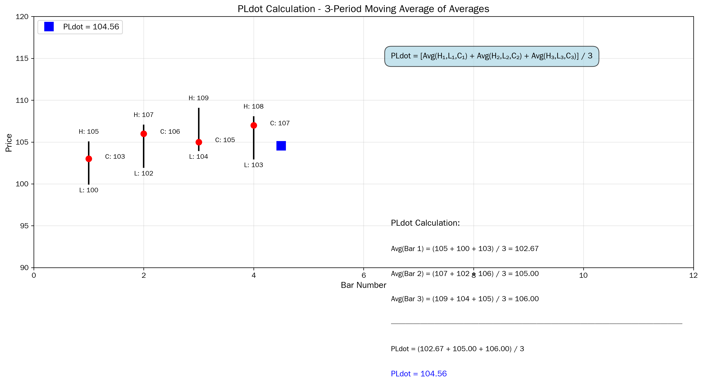
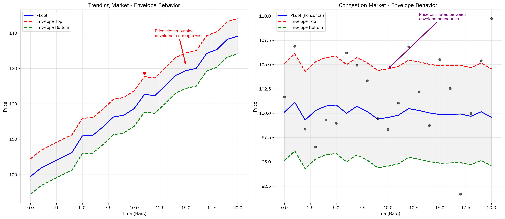
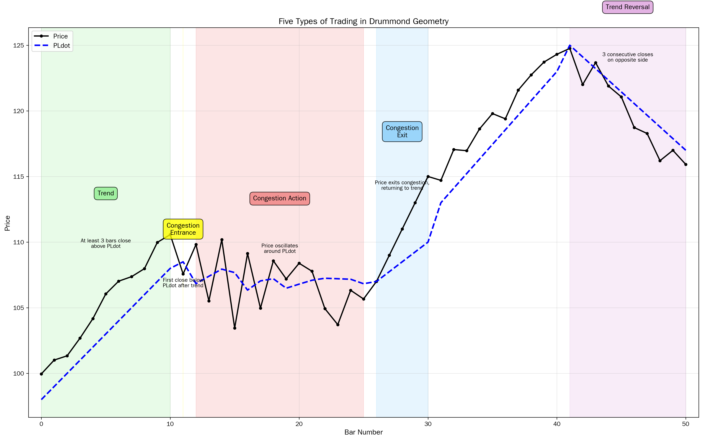

# Drummond Geometry: A Comprehensive Mechanics Analysis

## Executive Summary

Drummond Geometry represents a sophisticated technical analysis methodology developed by Canadian trader Charles Drummond starting in the 1970s and continuing through 2021. Unlike traditional technical analysis approaches that look backward at historical support and resistance levels, Drummond Geometry projects constantly evolving support and resistance areas into the future, providing traders with a forward-looking framework for market analysis. The methodology centers on three fundamental components: the PLdot (a specialized 3-period moving average), short-term two-bar trendlines called Drummond Lines, and multiple timeframe coordination. Statistical studies demonstrate positive effectiveness of predicted support and resistance levels, though individual trader results vary based on skill in recognizing and acting upon signals. The method applies universally across all asset classes and timeframes, from yearly charts down to intraday tick charts, making it adaptable to various trading styles including swing trading, position trading, and day trading.

## 1. Introduction: Origins and Foundation

Charles Drummond, born in 1936, developed this groundbreaking methodology over a span of more than four decades, establishing himself as both a major market theorist and a highly successful private trader. The methodology emerged from a fundamental observation that markets are extensions of the crowds that trade them, and that these crowds create repeating geometric patterns that remain self-similar across different timeframes. Drummond recognized that while past performance analysis forms the basis of technical analysis, the true value lies in understanding what the market will do when it encounters similar configurations in the future.

The methodology takes its name from the geometric nature of its approach, utilizing mathematical relationships between price points to project future market behavior. Ted Hearne, a Chicago-based trader and collaborator who helped bring Drummond's teachings to a wider audience through publications and seminars, described the approach as identifying "the intentions of the crowd accurately enough to get a distinct trading edge." This perspective treats historical price charts as visual representations of human crowd psychology in action, with support and resistance phenomena being real and measurable occurrences that can be predicted and projected.

Drummond Geometry was specifically designed for freely traded financial markets and has found particular application in forex trading, though it applies equally well to stocks, futures, and commodities. The methodology builds upon commonly accepted technical analysis assumptions but adds its own unique perspective: that timeframe charts are interrelated, move simultaneously, and can be visualized as existing within each other. This insight forms the foundation for one of Drummond Geometry's most powerful contributions—multiple timeframe coordination.

## 2. Core Technical Approaches and Methodologies

### 2.1 The Three-Legged Foundation

Drummond Geometry rests on three major elements that work together as a coherent whole. The first element involves identifying resistance and support and projecting them into the future. Traditional technical analysis identifies where support and resistance have been located historically and assumes these same levels will be relevant in the future. Drummond Geometry takes a different approach by constructing constantly evolving resistance and support areas from conventional tools like moving averages and trendlines, then projecting these areas into the near-term future. Traders using this method always know where support and resistance areas are that the market is moving into, rather than focusing on areas that existed in the past.

The second major element describes the market's current state and its next anticipated state. Drummond Geometry provides unambiguous definitions for five distinct types of trading: trend, congestion entrance, congestion action, congestion exit, and trend reversal. By clearly defining these states, the methodology enables traders to step inside the mind of the market, determine its present state, and predict the limited choices available for immediate future action. When the market is in a trend, it can only do two things: continue that trend or enter congestion. Similarly, when in congestion, it can only continue that congestion or exit into another trend. These clear definitions make monitoring market action efficient and effective because the checkpoints and checklists to watch are clearly identified.

The third major element coordinates the first two elements across multiple timeframes. This represents perhaps Drummond's most important contribution to technical analysis. The principle is simple yet powerful: if you can align support and resistance levels across various timeframes and take action when they coincide, while avoiding action when they do not reinforce each other, your success ratio can be up to three times better than relying on a single timeframe. This multiple timeframe approach recognizes that support and resistance in different timeframes react to price in predictable ways, with shorter timeframes reacting first, then progressively longer timeframes joining in.

### 2.2 Underlying Principles and Assumptions

The methodology builds upon several foundational principles. First, it accepts that charts have patterns that can be identified and will recur. Second, it recognizes that similar chart patterns exist in different timeframes, creating a fractal-like quality to market behavior. Third, it operates on the principle that prices in any given timeframe will center on a consensus value, and when price moves away from that consensus, it tends to revert to a mean—though this mean itself is constantly moving and changing as the market unfolds.

The methodology treats support and resistance as real phenomena that can be measured, predicted, and projected rather than vague concepts. Energy forces are conceptualized as wave-like phenomena that, in their various configurations, cause economic conditions, emotional states, and collective actions. The essential point is that crowd momentum does not stop at random points in time and space but rather at specific areas dictated by larger or smaller energy flows.

Drummond Geometry also recognizes that the crowd itself is an incredibly powerful force. When it moves, the crowd wants to move everything and everyone with it. When it stops, it wants to make everything around it stop as well. The crowd represents collective energy and manifests attractive energy, built from the need to belong, the need for protection and safety, and the need to feed, reproduce, and continue its existence. A trader who follows the crowd and goes with its flow will not be hurt, as that is the nature of a crowd—to protect its members. However, the crowd does not always move in the same direction; it stops, reconsiders, and changes direction, sometimes chaotically. Moreover, a crowd tends to overshoot its goal, not realizing until too late that it has swept past its target.

## 3. Calculation Methods and Mathematical Processes

### 3.1 The PLdot Formula and Calculation

The cornerstone of Drummond Geometry is the PLdot, where "PL" stands for Point and Line. This specialized moving average was empirically derived through Drummond's search for a tool that would distinguish between trend and congestion, run in a straight line sloped upward or downward in a trend, and quickly indicate changes in market conditions. The PLdot is a short-term moving average based on three price bars of data, capturing the trend versus non-trend activity of whatever timeframe is being charted.

The mathematical formula for the PLdot is precise and elegant:

**PLdot = [Avg(H₁,L₁,C₁) + Avg(H₂,L₂,C₂) + Avg(H₃,L₃,C₃)] / 3**

Where:
- H₁, L₁, C₁ represent the High, Low, and Close of the first bar
- H₂, L₂, C₂ represent the High, Low, and Close of the second bar
- H₃, L₃, C₃ represent the High, Low, and Close of the third bar

This formula can be expressed more compactly as:

**PLdot = (Avg[H(1),L(1),C(1)] + Avg[H(2),L(2),C(2)] + Avg[H(3),L(3),C(3)]) / 3**

The PLdot from the last three bars is plotted as a dot or line on the next bar to appear, meaning it is always projected one bar forward into the future. This forward-looking nature distinguishes it from traditional lagging indicators.

**Figure 1** illustrates the step-by-step calculation process. For a practical example using EUR/USD monthly data from early 2021, we can demonstrate the calculation for April 2021's PLdot:

For January 2021: High = 1.23494, Low = 1.20535, Close = 1.21227
- Average = (1.23494 + 1.20535 + 1.21227) / 3 = 1.21752

For February 2021: High = 1.22433, Low = 1.19522, Close = 1.20903
- Average = (1.22433 + 1.19522 + 1.20903) / 3 = 1.20952

For March 2021: High = 1.21132, Low = 1.17040, Close = 1.17270
- Average = (1.21132 + 1.17040 + 1.17270) / 3 = 1.18480

**April 2021 PLdot = (1.21752 + 1.20952 + 1.18480) / 3 = 1.20394**

This calculated PLdot of 1.20394 would be plotted on the April 2021 bar as it develops, providing traders with a dynamic reference point for that month's market action.

### 3.2 PLdot Properties and Characteristics

The PLdot possesses several distinctive characteristics that make it exceptionally useful for market analysis. It maintains a constant relationship to the immediate past, capturing the recent energy of the hour, day, or other time period being analyzed. The PLdot represents the consensus of the crowd in a mathematical sense, serving as the center of energy for the most recent three bars.

What sets the PLdot apart from other moving averages is its behavior in different market conditions. In a trending market, the PLdot moves in a straight line with a consistent slope in the direction of the trend. In a congestion zone, it moves horizontally. This dual behavior makes it extraordinarily sensitive to market trendiness. The PLdot is quick both to register the change of a market out of congestion into trend and to recognize the end of a trend, with very little lag compared to traditional moving averages.

The sensitivity of the PLdot stems from its construction. Using a short three-period averaging scale means it responds rapidly to changes. Including the high, low, and close in the calculation—rather than just the close—means it considers both volatility and the bar's resting place (the close). This combination creates a moving average that is both responsive and meaningful.

An important concept in Drummond Geometry is "dot push," which describes price movement away from the PLdot in a trending market. When a market is in a strong trend, the PLdot actively pushes price in the direction of the trend, acting as dynamic support in an uptrend or dynamic resistance in a downtrend. The complementary concept is "dot refresh," which describes market movement returning to the PLdot. After price moves away from the PLdot, it tends to refresh back toward it, creating trading opportunities.

### 3.3 The Envelope System

To give the methodology greater analytical muscle, Drummond added a simple envelope system constructed from a constant mathematical relationship based on the components of the PLdot. The envelope consists of two parallel lines—the envelope top and envelope bottom—that are typically based on a 3-period moving average, the same length as the PLdot itself. These envelopes are not designed to contain all price activity within their boundaries, as many envelope systems attempt to do. Instead, they offer a constant matrix against which market moves can be measured.

The envelope top is positioned above the PLdot, and the envelope bottom is positioned below it. The spacing is typically derived from a multiple of the average true range or a fixed percentage of price. In many implementations, the envelope boundaries are set at a distance that represents approximately one standard deviation of recent price movement from the PLdot.

The envelope system proves particularly valuable for tailoring trading techniques to different market conditions. The relationship between price action and the envelope boundaries reveals the character of the market. When the market is in congestion, price tends to oscillate from one side of the envelope to another, giving traders a clear idea of where buying and selling zones will be placed. The envelope top acts as resistance, and the envelope bottom acts as support, with price bouncing between these levels.

**Figure 2** demonstrates the contrasting behavior of the envelope system in trending versus congestion markets. In a strong trend, the envelope functions differently. Price bars often close outside the envelope in the direction of the trend, and the envelope boundary itself functions as support or resistance. The envelope top or bottom appears to "push" price in the trend direction. Price retracements in a trend typically do not move to the opposite side of the envelope but instead tend to stop at the level of the PLdot.

This phenomenon, where the envelope top pushes price upward in an uptrend or the envelope bottom pushes price downward in a downtrend, is known as a "C-wave." The term comes from the force of the sea as it washes over a harbor breakwater in a sea-wave. A C-wave represents high-energy market thrust and is a sign of strong directional energy on that timeframe. When traders identify a yearly C-wave, for instance, it carries ominous implications for counter-trend positions.

### 3.4 Drummond Lines: Two-Bar Trendlines

The second fundamental element of Drummond Geometry involves the use of short-term, two-bar trendlines, commonly called Drummond Lines. Like the PLdot, these short-term trendlines are projected into the future, indicating points of interest on the first upcoming bar—the bar that has yet to trade. These lines indicate areas of energy termination, zones where the market is likely to stop its movement.

There are several types of these lines, drawn in various configurations under different market conditions. The lines are named using a notation system such as "5-1," "5-2," "5-3," "5-9," "6-1," "6-5," "6-6," and "6-7," where the numbers refer to specific points on the previous two bars that are connected to project future support or resistance. The "5/9 down" and "5/9 up" lines, for example, are important termination lines that frequently mark significant turning points.

These two-bar trendlines, combined with the short-term moving averages (PLdot and envelope), establish support and resistance areas in the near-term future with a high degree of accuracy. The projected lines create zones of interest rather than precise price points, recognizing that markets tend to reach general areas rather than exact levels.

The Drummond Lines contribute to defining "nearby resistance" and "nearby support" areas, as well as "further out" support and resistance areas. The nearby zones are typically shown as gray or green boxes on charts, representing an assemblage of several lines and levels located close to current price. The further-out zones represent more distant support and resistance levels that may come into play if nearby levels are broken.

## 4. Step-by-Step Mechanics of Application

### 4.1 Setting Up the Timeframe Structure

The first critical step in applying Drummond Geometry is establishing a proper timeframe structure. Traders must begin with clear objectives, as these will determine the arrangement of timeframes. The focus timeframe is the chart on which trades will be placed. For swing traders trying to capture moves lasting two to five days, the daily chart becomes the focus timeframe. Day traders would use an hourly or smaller timeframe as their focus, while long-term position traders might use weekly or monthly charts.

Once the focus timeframe is established, traders must place it in the context of a higher timeframe. This provides perspective and establishes the larger market context. Day-to-day position traders using a daily focus should refer to weekly charts. Those trading weekly positions should reference monthly charts. This higher timeframe reveals the bigger picture and helps identify major support and resistance levels that will influence the focus timeframe.

Third, traders select a lower timeframe to monitor the market at key decision points. This lower timeframe allows determination, at the earliest possible moment, of exactly what is occurring at critical areas of significant support and resistance. For daily traders, an hourly chart serves this monitoring function. For weekly traders, the daily chart fills this role. This three-timeframe structure—higher for context, focus for trade placement, and lower for monitoring—forms the operational framework for Drummond Geometry analysis.

### 4.2 Calculating and Plotting the PLdot

On each selected timeframe, traders calculate the PLdot using the formula detailed in Section 3.1. This calculation is performed for each new bar as it completes. The PLdot value is then plotted on the next bar position, the bar that has not yet formed. This forward projection is crucial—the trader is not looking at where the PLdot was, but where it will be as the next bar develops.

Modern trading software can automate this calculation, but understanding the manual process ensures proper application. For each completed bar, traders take the average of the high, low, and close. This is done for the three most recent completed bars. These three averages are then averaged together to produce the PLdot, which is plotted at the position of the next (developing or future) bar.

As new bars form and complete, the PLdot is recalculated and repositioned. This creates a continuous line (or series of dots, hence the name) that moves across the chart. Traders observe the slope and direction of this PLdot line. A rising PLdot with consistent slope indicates an uptrend. A falling PLdot indicates a downtrend. A horizontal or erratic PLdot indicates congestion.

### 4.3 Constructing the Envelope System

With the PLdot established, traders next construct the envelope system. The envelope top and envelope bottom are typically plotted as lines parallel to the PLdot, offset by a calculated distance. The standard approach uses a 3-period moving average for the envelope components, matching the PLdot's period.

The exact spacing of the envelope boundaries varies by implementation and can be customized to the specific market and timeframe being analyzed. Some traders use a multiple of the average true range (ATR), while others use a fixed percentage of price. The key is consistency—once a method is chosen for a particular market and timeframe, it should be maintained to allow pattern recognition.

The envelope is plotted both on historical bars and projected forward onto the developing bar. This gives traders a clear visual framework showing where price is in relation to the envelope boundaries. In congestion, price should oscillate between the envelope top and bottom. In a trend, price should break out of the envelope in the trend direction and stay outside it, with the broken envelope boundary acting as support or resistance.

### 4.4 Identifying Support and Resistance Zones

Using the PLdot, envelope, and Drummond Lines (two-bar trendlines), traders identify support and resistance zones on each bar. These zones are typically displayed as colored boxes or shaded areas above and below the price bar. The "nearby resistance" zone sits just above current price and is defined by the convergence of multiple Drummond Lines and the envelope top. The "nearby support" zone sits below current price and is similarly defined.

"Further out" resistance and support zones are also identified. These represent more distant levels that come into play if nearby levels break. The identification process involves drawing the two-bar trendlines according to Drummond Geometry rules, noting where they intersect with the developing bar's position, and clustering these levels into zones.

This zoning approach recognizes that markets tend to react to areas rather than precise price points. When multiple technical elements converge in a narrow price range, that convergence creates a zone of heightened probability for market reaction. The more elements that align in a zone, the stronger that zone becomes.

### 4.5 Coordinating Multiple Timeframes

The critical step that elevates Drummond Geometry beyond single-timeframe analysis is the coordination of support and resistance across multiple timeframes. Traders take the support and resistance zones identified on the higher timeframe and overlay them onto the focus timeframe chart. This is typically done by drawing horizontal lines or zones on the focus chart at the levels where higher timeframe support and resistance exists.

For example, if analyzing with a daily focus timeframe and a weekly higher timeframe, the trader identifies the weekly nearby resistance and support zones. These weekly zones are then drawn as wider bands on the daily chart. Similarly, the monthly zones (from an even higher timeframe) might be overlaid as the broadest bands.

**Figure 3** illustrates this coordination principle across monthly, weekly, and daily timeframes. The key insight comes when the focus timeframe's projected support or resistance aligns with a higher timeframe's support or resistance. This alignment creates high-probability zones where the market is much more likely to react strongly. A daily support zone that coincides with weekly support creates a reinforced level with perhaps three times the probability of holding compared to a daily support zone that stands alone.

Conversely, when focus timeframe support or resistance does not align with higher timeframe levels, traders should be more cautious. Such zones have a higher probability of breaking because they lack the reinforcement from larger timeframe energy flows. This discrimination between reinforced and isolated zones forms the basis for high-probability trade selection.

### 4.6 Determining the Type of Trading

With the technical elements in place, traders must determine the current market state by identifying which of the five types of trading is occurring. This determination is made on each timeframe being analyzed and follows strict, unambiguous definitions.

**Trend Trading** occurs when three successive price bars close on the same side of the PLdot. If three bars close above the PLdot, an uptrend is confirmed. If three bars close below the PLdot, a downtrend is confirmed. The market remains in this trend state until a bar closes on the opposite side of the PLdot. For additional confirmation, traders look for the PLdot itself to be sloping in the direction of the trend. Ideally, successive PLdot values should be moving steadily upward in an uptrend or downward in a downtrend, creating a straight line rather than oscillating.

**Congestion Entrance Trading** is identified when the market has been in a trend (at least three bars closed on one side of the PLdot), but the next bar closes on the opposite side of the PLdot. This first close on the opposite side signals the market's entry into a potential congestion or consolidation period. It does not necessarily mean the trend has reversed, only that it has paused. The market is entering what may be a brief consolidation, a lengthy sideways range, or potentially the beginning of a trend reversal.

**Congestion Action Trading** describes the period between congestion entrance and congestion exit. During this phase, price bars close on alternating sides of the PLdot, or multiple bars may close on one side followed by bars closing on the other side, without establishing the three consecutive closes needed to signal a new trend. The PLdot itself typically moves horizontally rather than maintaining a consistent slope. Price oscillates between the nearby support and resistance zones, and these zones tend to hold rather than break. Congestion action can be short-lived, long-lived, or lead to a sharp trend reversal. It often represents a continuation pattern such as a pennant, flag, or triangle when it occurs within a larger trend.

**Congestion Exit Trading** occurs when the market begins to exit the congestion area and appears to be resuming the original trend. This is signaled when price breaks out from the congestion range decisively, often closing beyond the nearby resistance (in an uptrend resumption) or nearby support (in a downtrend resumption). The PLdot begins to develop a slope again in the direction of the resuming trend. For aggressive traders, congestion exit provides a signal to add to existing positions, as it suggests the consolidation was merely a pause in the larger trend.

**Trend Reversal Trading** is confirmed when three consecutive bars close on the opposite side of the PLdot from the previous trend. If a market was in an uptrend (three or more consecutive closes above the PLdot) and then produces three consecutive closes below the PLdot, a trend reversal from bullish to bearish is confirmed. Similarly, three consecutive closes above the PLdot after a downtrend confirms a bearish-to-bullish reversal. This signal indicates traders should exit positions aligned with the old trend and consider reversing their position to align with the new trend direction.

**Figure 4** illustrates the progression through all five types of trading as a market moves from trend to congestion to reversal. Understanding which type of trading is currently active and which type is likely next allows traders to anticipate market behavior and prepare appropriate responses.

### 4.7 Monitoring Market Action and Trade Execution

With all elements in place—PLdot and envelope plotted, support and resistance zones identified across multiple timeframes, and the current type of trading determined—traders monitor how price behaves at key levels. The monitoring process focuses on decision points where timeframe-coordinated support or resistance levels exist.

As price approaches these key levels, traders watch for specific behaviors. At resistance, does price stall and retreat, or does it push through cleanly? If it breaks through, does it immediately retrace back below the level (a false breakout), or does it sustain above the level? At support, does price bounce cleanly, or does it break below and continue lower? These observations inform trading decisions.

Trade entries typically occur at high-probability zones where multiple timeframe support or resistance aligns. For example, a trader using a daily focus timeframe might enter a long position when daily price tests daily support that coincides with weekly support, particularly if the monthly context is bullish. The entry would be timed using the lower monitoring timeframe (perhaps hourly) to identify the precise moment when price shows signs of respecting the support level.

Stop-loss levels are typically placed just beyond the support or resistance level that justified the trade. If entering long at coordinated support, the stop would go just below that support zone, acknowledging that if the level truly breaks, the trade thesis is invalidated. Profit targets can be set at the next resistance zone, at the PLdot level (in the case of trading reversals back to the PLdot), or using a risk-reward ratio approach.

Advanced traders using Drummond Geometry also watch for "exhaust" patterns, where the market runs out of energy in one direction and sharply reverses back toward its PLdot. These exhausts occur when price extends far beyond the envelope in a strong move, then suddenly reverses. They represent high-probability turning points and can be traded for significant gains.

## 5. Practical Applications and Real-World Use Cases

### 5.1 Swing Trading with Drummond Geometry

One of the most popular applications of Drummond Geometry is swing trading, which involves trades lasting from two to five days. This trading style appeals to those who want to trade frequently but cannot monitor markets constantly throughout the day. The methodology offers a reliable approach to identifying the tops and bottoms of short-term market swings, and the combined gains from these swings can be substantial.

In swing trading applications, the daily chart serves as the focus timeframe, the weekly chart provides context, and an hourly or 4-hour chart allows precise monitoring at key decision points. Traders identify weekly support and resistance zones and overlay them on the daily chart. They then look for daily price action that tests these weekly levels while the weekly context remains favorable for the intended trade direction.

For example, if the weekly chart shows an uptrend with the PLdot sloping upward, and weekly support is projected in a certain zone, a swing trader would wait for daily price to decline into that weekly support zone. Using the hourly chart for monitoring, the trader watches for signs that the support is holding—perhaps a reversal candlestick pattern, a bounce off the daily PLdot that sits within the weekly support zone, or simply a halt in the decline. Entry occurs when these signs emerge, with a stop just below the weekly support zone and a target at weekly resistance or the weekly PLdot.

The practical benefit of this approach is that each daily market swing often forms the high or low of a weekly bar. By projecting weekly highs and lows using Drummond Geometry, the swing trading problem becomes simpler. The trader can harvest the bulk of the weekly move by following daily action as price moves between weekly projected support and resistance levels.

### 5.2 Position Trading and Long-Term Forecasting

Drummond Geometry proves equally powerful for longer-term position trading and even yearly forecasting. Ted Hearne demonstrated the methodology's application to yearly high and low predictions in interbank forex trading, showing that educated, accurate forecasts of annual highs and lows in major currencies are achievable.

In long-term applications, the yearly chart provides the highest context, quarterly and monthly charts offer intermediate perspective, and weekly or daily charts serve as monitoring tools. The yearly timeframe establishes major support and resistance zones using the PLdot, envelope, and Drummond Lines. These yearly levels, projected forward, provide targets for the year's high and low.

A real-world example from 2002 demonstrates this application on the S&P 500. At the beginning of 2002, the S&P had completed the year 2001 with a low at 943 that hit yearly support at what Drummond Geometry identifies as a "5/9 up" line. The market then experienced a PLdot refresh move, closing the year at 1,153. This set up the critical question for 2002: would the refresh continue upward to the yearly PLdot, or would the market turn and continue its downtrend?

The yearly envelope bottom sat at approximately 1,200, and this level became crucial. In Drummond Geometry terms, if the envelope bottom began pushing price downward (a yearly C-wave), it would signal very strong bearish energy. Traders monitored how the market acted at this resistance level across all timeframes. The quarterly chart showed the PLdot unable to generate upward push. The monthly chart revealed the strong up-move from September-December 2001 losing energy and stalling at the critical resistance. The weekly chart showed the market losing energy and shifting into a downtrend.

When the resistance at 1,200 held and proved strong, pushing the market down, traders knew a yearly C-wave was developing. The market eventually declined to test yearly support at 771, moving toward the further-out support zone between 600 and 700 on the S&P. This real-world example illustrates how Drummond Geometry enables broad market predictions over many months, combined with specific monitoring tools to confirm that events are unfolding as anticipated.

### 5.3 Forex Market Applications

The foreign exchange market represents an ideal application for Drummond Geometry, as the methodology was specifically designed with forex in mind. Currency markets' 24-hour nature and high liquidity create clean price action that respects geometric support and resistance levels effectively.

A practical example using EUR/USD on a monthly timeframe demonstrates the application. Using the PLdot calculation shown earlier, traders identified that the April 2021 PLdot was 1.20394. To determine if the market was in a trend, traders looked for three consecutive months closing above or below the PLdot line. When analyzing the PLdot values for preceding months (April 2021: 1.20394, March 2021: 1.21411, February 2021: 1.20586, January 2021: 1.19073), the declining pattern of the PLdot line itself suggested downward pressure.

To identify trend versus congestion, traders examined whether three consecutive candlesticks closed above or below the PLdot line. If January, February, and March all closed below their respective PLdot values, this would confirm a bearish trend. If the pattern was mixed, congestion action would be indicated. The angle of the PLdot line—rising, falling, or horizontal—provides additional confirmation of market state.

For shorter-term forex trading, traders might use a 4-hour focus chart with daily charts for context and 15-minute or 1-hour charts for monitoring. The same principles apply regardless of timeframe. The PLdot and envelope are calculated on each timeframe, zones are identified, and trades are taken when multiple timeframes align.

A particularly powerful forex application involves trading breakouts. When a currency pair is in a clear trend on a higher timeframe, and that trend is confirmed by the PLdot angle and consecutive closes on one side of the PLdot, traders watch for breakout signals. A breakout occurs when price closes beyond the envelope boundary in the direction of the trend. For a bearish breakout, the market must already be in a downtrend (minimum three consecutive closes below the PLdot), the PLdot line must have a declining angle with each dot making a new low, and a candlestick must close below the lower envelope boundary.

The trading rules for such a bearish breakout are straightforward: enter by selling at the close of the candlestick that triggers the signal. Place a stop-loss at the highest point of that trigger candlestick. For take-profit, either use a risk-reward ratio of 1:2 (gaining $2 for every $1 risked) or trail the stop with each subsequent candlestick to ride the move as far as it goes. These breakouts often precede significant economic events and can produce substantial profits.

### 5.4 Day Trading Applications

For day traders, Drummond Geometry provides a framework for identifying intraday turning points with precision. The focus timeframe might be a 15-minute or 5-minute chart, with hourly or 4-hour charts providing context and 1-minute charts for precise entry and exit monitoring.

The same five types of trading apply on intraday timeframes. A day trader might identify that the 4-hour chart is in an uptrend, with the 4-hour PLdot sloping upward and recent bars closing above it. The 4-hour nearby support zone projects into a specific price range. The trader then drops to the 15-minute focus chart and watches for price to test this 4-hour support zone during a normal intraday retracement.

On the 15-minute chart, the trader observes whether the 15-minute PLdot begins to provide support in this area, whether the 15-minute nearby support zone aligns with the 4-hour support, and whether price action shows signs of the support holding. The 1-minute monitoring chart might show the precise moment when buying pressure resumes, perhaps with a series of green candles and the price bouncing off the 1-minute PLdot. This confluence of timeframe support provides the entry signal.

The advantage for day traders is that Drummond Geometry's forward-looking nature means they know in advance where key levels exist. Rather than reacting to price moves after they happen, traders can position themselves ahead of time, entering at support with tight stops and favorable risk-reward ratios.

## 6. Common Patterns and Configurations

### 6.1 The PLdot Push Pattern

One of the most reliable patterns in Drummond Geometry is the PLdot push, which occurs in strong trending markets. In this configuration, the PLdot develops a consistent, straight-line slope in the direction of the trend. Each successive PLdot value moves steadily higher in an uptrend or steadily lower in a downtrend, creating what appears as a smooth, angled line on the chart.

During a PLdot push, price bars close above the envelope top in an uptrend or below the envelope bottom in a downtrend. The broken envelope boundary acts as support in an uptrend or resistance in a downtrend. When price retraces during a PLdot push, it typically returns only to the PLdot level, not to the opposite envelope boundary. This creates a pattern where the PLdot serves as the floor in an uptrend or the ceiling in a downtrend.

Traders recognize this pattern by observing consecutive bars closing outside the envelope in the trend direction, a steadily sloping PLdot, and shallow retracements that find support or resistance at the PLdot level. The pattern continues until exhaustion sets in, signaled by price either pulling back inside the envelope or showing divergence between price movement and the PLdot angle.

### 6.2 The PLdot Refresh Pattern

The PLdot refresh pattern occurs when price has extended away from the PLdot and then returns to it. This pattern appears in various contexts. After a strong move that creates distance between price and the PLdot, the market tends to refresh back toward this consensus level. The refresh can occur as a retracement within an ongoing trend or as a recovery after an exhaust.

A classic refresh pattern develops when the market completes an exhaust move—pushing far beyond the envelope, running out of energy, and then sharply reversing. The initial reversal is typically strong, but after the initial burst, the market often pauses and then continues back toward the PLdot over several bars. This refresh back to the PLdot creates trading opportunities, as the PLdot level often provides support (after a downside exhaust) or resistance (after an upside exhaust) where the market may pause or reverse again.

Traders can anticipate refresh targets by observing the PLdot position and expecting price to gravitate toward it, especially when price has extended far from it. The concept of "live PLdot" versus "static PLdot" becomes relevant here. The live PLdot is constantly recalculating as new bars form, while a static PLdot represents the level that existed at a specific past bar. During a refresh, price may target either the current live PLdot or a static PLdot from several bars back, depending on the strength of the move.

### 6.3 The Exhaust Pattern

Exhausts represent some of the most powerful turning points in Drummond Geometry. An exhaust occurs when the market runs out of energy in one direction and sharply reverses toward its PLdot. The pattern is characterized by price extending well beyond the envelope boundary—often closing multiple bars outside the envelope—and then suddenly reversing direction with conviction.

The mechanics of an exhaust relate to crowd psychology and energy depletion. As a strong move develops, the crowd becomes increasingly committed to that direction. Momentum builds, and the move accelerates. Eventually, the move extends so far from the PLdot (the consensus level) that it becomes overextended. There are no more buyers to push it higher (in an upside exhaust) or sellers to push it lower (in a downside exhaust). At this point of maximum extension, the slightest counter-pressure creates a reversal.

The reversal in an exhaust is typically sharp and swift, often occurring within one or two bars. Price snaps back toward the PLdot, frequently reaching it or even overshooting to the opposite side. Volume often expands during the reversal as trapped traders exit positions and opportunistic traders enter counter-trend positions.

Traders can anticipate potential exhausts by measuring the distance between price and the PLdot. When this distance reaches extreme levels—typically multiple times the normal envelope width—the probability of an exhaust increases. Additionally, if the market reaches a Drummond Line termination level (such as a 5/9 line) while in an extended state, the probability of an exhaust at that level increases significantly.

### 6.4 The C-Wave Pattern

The C-wave pattern represents exceptionally strong directional energy and is identified when the envelope top or bottom actively pushes price in a trend. In a normal trend, price respects the envelope as a general boundary but may oscillate near it. In a C-wave, the envelope boundary itself becomes a dynamic pusher of price.

In an uptrend C-wave, the envelope top breaks above itself successively, with each bar's envelope top higher than the previous bar's envelope top, and price consistently closes above or near the envelope top. The envelope top appears to pull or push price upward. In a downtrend C-wave, the envelope bottom pushes price downward in the same manner, with price closing at or below the envelope bottom as the envelope itself descends.

C-waves are named for the force of a sea-wave washing over a breakwater—an unstoppable force. They indicate that the trend has exceptional strength on that particular timeframe. A yearly C-wave, for instance, carries much more significance than a daily C-wave. When a higher timeframe displays C-wave characteristics, it suggests a prolonged, powerful trend that will likely persist.

Traders recognize C-waves by observing consecutive bars closing outside the envelope in the trend direction, with the envelope boundary itself showing a strong slope. The pattern suggests staying with the trend and avoiding counter-trend trades. The C-wave typically continues until the market reaches a major termination level identified by Drummond Lines from an even higher timeframe.

### 6.5 Congestion Oscillation Pattern

In congestion action trading, a distinctive oscillation pattern emerges. Price swings between the nearby support zone and the nearby resistance zone, with neither zone breaking decisively. The PLdot moves horizontally or in a tight range rather than developing a clear slope. Bars close on alternating sides of the PLdot without establishing the three consecutive closes needed to signal a trend.

The envelope boundaries in this pattern act as reliable turning points. Price approaches the envelope top, meets resistance, and reverses toward the envelope bottom. It then finds support there and reverses back upward. This creates a range-bound, oscillating pattern that can persist for many bars.

Traders profit from congestion oscillation by buying near the envelope bottom or nearby support zone and selling near the envelope top or nearby resistance zone. The key is recognizing that the market is in congestion action trading rather than trending, which requires observing the PLdot's horizontal movement and the failure of either support or resistance to break decisively.

The congestion pattern eventually resolves in one of two ways: congestion exit (price breaks out and resumes the previous trend) or trend reversal (price breaks out in the opposite direction from the previous trend). Traders watch for the warning signs of resolution, such as the PLdot beginning to develop a slope, consecutive closes on one side of the PLdot, or a decisive break beyond the envelope boundaries.

## 7. Tools and Software Implementation

### 7.1 Trading Platform Implementations

Drummond Geometry can be implemented on various trading platforms, though it requires either manual calculation and plotting or specialized software. TradeStation has been a popular platform for Drummond Geometry implementation, with several indicators and automated systems developed specifically for this methodology. The platform's programming language (EasyLanguage) allows creation of custom indicators that calculate the PLdot, envelope, and Drummond Lines automatically.

TradingView, a widely accessible browser-based charting platform, hosts multiple Drummond Geometry implementations. One implementation by user "sebghergh" provides the basic PLdot, envelopes, and energy points. This version calculates the PLdot as the midpoint of the previous bar's high and low (a simplified approach compared to the full three-bar average-of-averages formula), creates envelope lines spaced by a percentage of the Average True Range (ATR), and identifies energy points at the intersections of envelopes and moving averages.

A more comprehensive TradingView implementation by "JordanMT" offers an all-in-one indicator that includes proprietary enhancements. This advanced version features dynamic PLdot calculation with smoothing techniques to minimize lag, adaptive envelope boundaries responding to volatility, Areas 1-6 energy zones based on Drummond's principles, termination indicators for trend exhaustion points, PLTwoDot forward projection (projecting the PLdot position two sessions forward), and cross-timeframe analysis allowing HTF (higher timeframe) terminations to be projected onto LTF (lower timeframe) charts.

The JordanMT indicator addresses a common limitation in many implementations: the Pine Script language's 64-plot count limitation. To work within this constraint, some terminations (like 6-6 and 6-7 Up/Down) are disabled for cross-timeframe projection, though they remain functional on the native timeframe. Closed terminations (5-1 Up/Down, 5-9 Up/Down) are drawn as labels rather than continuous lines due to these limitations.

### 7.2 Key Features in Software Implementations

Professional Drummond Geometry software typically includes several essential features. Automatic PLdot calculation and plotting on any timeframe removes the manual calculation burden and ensures accuracy. Dynamic envelope calculation with customizable spacing parameters allows traders to adjust the methodology to different markets and volatility conditions.

Support and resistance zone visualization, typically shown as colored boxes or shaded areas on each bar, makes it easy to identify where the market is likely to encounter support or resistance. Multiple timeframe overlay functionality allows higher timeframe support and resistance to be displayed on lower timeframe charts, facilitating the critical timeframe coordination that makes Drummond Geometry so powerful.

Advanced implementations include termination line plotting, automatically drawing the various two-bar trendlines (5-1, 5-2, 5-3, 5-9, 6-1, 6-5, etc.) and projecting them forward onto developing bars. Type of trading identification helps traders know at a glance whether the market is in trend, congestion entrance, congestion action, congestion exit, or trend reversal.

Some implementations provide live data overlay from higher timeframes, showing the current PLdot, envelope top (ETOP), envelope bottom (EBOT), and area levels from daily, weekly, monthly, quarterly, or yearly charts in real-time on a lower timeframe chart. This feature particularly benefits intraday traders who need to monitor higher timeframe levels while focused on short-term price action.

### 7.3 Manual Implementation Approach

For traders preferring manual implementation or working with platforms lacking automated Drummond Geometry tools, the methodology can be applied manually with disciplined calculation and charting. This approach actually provides educational value, as the manual process deepens understanding of the methodology's mechanics.

The manual trader begins by creating a spreadsheet with columns for each bar's high, low, and close. Additional columns calculate the average of H, L, and C for each bar. The PLdot column then averages the three most recent bar averages and displays this value at the next bar position. Similar calculations create the envelope top and bottom values.

On the price chart, the trader manually draws horizontal lines or plots dots at the calculated PLdot positions. The envelope boundaries are drawn as parallel lines. Drummond Lines require identifying specific points on the previous two bars according to the line definitions, then drawing trendlines through these points and extending them to the next bar.

While time-consuming, manual implementation forces the trader to intimately understand each component's calculation and behavior. Many successful Drummond Geometry practitioners recommend starting with manual application on a weekly chart for at least several months before transitioning to automated tools. This foundation ensures proper interpretation when using software and helps recognize when software may be misconfigured or malfunctioning.

## 8. Effectiveness, Limitations, and Considerations

### 8.1 Statistical Effectiveness

Statistical studies of Drummond Geometry's predicted support and resistance levels show positive effectiveness overall. The Drummond Lines, particularly the PLdot and short-term two-bar trendlines, demonstrate ability to project support and resistance areas that the market subsequently respects. However, interpreting these statistics requires care, as noted in Wikipedia's discussion of the methodology.

Raw statistical measures can be misleading if not carefully interpreted. For example, a study measuring whether Drummond Lines "hold" or "break" might categorize a line as "holding" even when price never approached that line closely enough to truly test it. A more meaningful analysis would measure how price behaves when it actually reaches projected support or resistance zones, evaluating the percentage of times these levels cause meaningful reactions versus being violated without effect.

The multiple timeframe coordination aspect significantly improves effectiveness. Studies comparing single-timeframe trading to coordinated multi-timeframe trading using Drummond Geometry show that the multi-timeframe approach can improve success ratios by a factor of up to three times. This substantial improvement justifies the additional complexity of tracking multiple timeframes.

### 8.2 Skill-Based Variability

Individual trader results with Drummond Geometry vary considerably, and this variability is acknowledged in the methodology's literature. The variation stems from the skill required to recognize and act on signals correctly. Unlike purely mechanical trading systems that generate explicit buy and sell signals, Drummond Geometry provides a framework for analysis. The trader must still exercise judgment in several areas.

Interpreting whether a support or resistance zone is truly being tested or merely approached peripherally requires experience. Determining whether a break of support or resistance is genuine or a false breakout demands skill in reading price action. Deciding which timeframe's signals to prioritize when different timeframes give conflicting information involves judgment. Recognizing the subtle patterns that precede exhausts or signal strong C-wave development takes practice.

These skill requirements mean that Drummond Geometry, while powerful, is not a "black box" system that can be applied mechanically with consistent results. Traders must invest time in education, practice on historical charts (backtesting), and develop pattern recognition abilities. The methodology's creator, Charles Drummond, emphasized this through his teaching approach, which included extensive coursework and continuing education for serious students.

### 8.3 Psychological and Practical Challenges

Several practical challenges face traders implementing Drummond Geometry. The need to monitor multiple timeframes simultaneously can be overwhelming for beginners. A trader might need to track monthly, weekly, daily, and 4-hour charts all at once, understanding the state of each timeframe and how they interact. This multi-dimensional view requires mental organization and disciplined workflow.

The forward-looking nature of the methodology, while advantageous, also introduces uncertainty. Projected support and resistance zones exist in the future, on bars that haven't formed yet. As the market develops and new bars form, these projections update and shift. The PLdot value for the developing bar changes throughout that bar's formation as the high, low, and close evolve. This dynamic quality means traders must continuously update their analysis rather than relying on static levels.

Market gaps present special challenges for Drummond Geometry, particularly in markets that close overnight such as stock indices and individual stocks. When a market gaps over a projected support or resistance zone without trading at those price levels, the methodology's predictions cannot be tested. This is less of an issue in 24-hour markets like forex and cryptocurrencies, which is one reason Drummond Geometry found particular favor in forex trading.

### 8.4 Limitations and Scope

Drummond Geometry works best in liquid, freely traded markets where price action reflects genuine supply and demand dynamics rather than manipulation or thin liquidity. In thinly traded instruments, support and resistance may not form at projected levels because insufficient trading volume exists to create meaningful zones. Very volatile instruments, particularly those subject to sudden news-driven gaps, may violate projected zones with such force that the methodology's gradual support/resistance framework becomes less relevant.

The methodology assumes that markets move in somewhat rational, crowd-driven patterns that reflect energy flows and create recognizable geometry. In situations where this assumption breaks down—such as during flash crashes, liquidity crises, or intervention by central banks or large institutional traders—the projected support and resistance may fail to materialize as expected.

Drummond Geometry also requires sufficient historical data to establish meaningful calculations. Newly listed instruments with limited price history may not provide enough bars for reliable PLdot and envelope calculations, particularly on higher timeframes. The methodology works progressively better as more data becomes available and patterns establish themselves.

## 9. Conclusion

Drummond Geometry represents a comprehensive and sophisticated approach to technical market analysis that distinguishes itself through several innovative contributions. The methodology's forward-looking orientation, projecting support and resistance into the future rather than relying solely on historical levels, provides traders with anticipatory rather than reactive analysis capabilities. The clear, unambiguous definitions of the five types of trading create a framework for understanding market state and anticipating state transitions. Most significantly, the systematic coordination of multiple timeframes elevates the methodology beyond conventional single-timeframe technical analysis.

At the heart of the system lies the PLdot, an elegantly simple yet remarkably effective three-period moving average that captures both trend direction and market consensus. Combined with the envelope system and Drummond Lines, it creates a complete framework for identifying where price is likely to encounter support and resistance. The mechanics of calculation are straightforward enough for manual implementation, yet the patterns and configurations that emerge from these calculations reveal the hidden structure of market behavior.

The practical applications span the full spectrum of trading timeframes and styles. Swing traders find value in the daily-weekly coordination for capturing multi-day moves. Position traders and investors use yearly-quarterly-monthly coordination for long-term forecasting and trend following. Day traders apply the methodology to intraday timeframes for precision entry and exit timing. Forex traders, in particular, have embraced the methodology as it was specifically designed with currency markets in mind.

Real-world examples, such as the 2002 S&P 500 market crash analysis and forex breakout trading applications, demonstrate the methodology's practical utility. Traders using Drummond Geometry were able to anticipate the major downturn in 2002 by recognizing the yearly C-wave development and monitoring how resistance levels held across multiple timeframes. This capability to make educated forecasts months in advance, while maintaining the flexibility to adjust if market behavior deviates from expectations, exemplifies the methodology's power.

Common patterns such as PLdot push, PLdot refresh, exhausts, C-waves, and congestion oscillations provide recognizable configurations that traders can learn to identify and trade. These patterns recur across all timeframes, creating fractal-like similarities that reinforce the methodology's universal applicability. Understanding these patterns transforms market analysis from a reactive exercise into a proactive anticipation of likely scenarios.

The methodology's effectiveness has been validated through statistical studies and decades of practical application by traders worldwide. However, this effectiveness is mediated by trader skill—the methodology provides a framework, but successful application requires pattern recognition, judgment, and experience. This skill requirement, rather than being a weakness, actually contributes to the methodology's enduring value. Unlike purely mechanical systems that work until they don't, Drummond Geometry provides a flexible analytical framework that adapts to changing market conditions when applied by skilled practitioners.

For traders seeking to implement Drummond Geometry, the path forward involves several steps. Begin with education to understand the theoretical foundation and calculation mechanics. Practice manual calculation on a higher timeframe (weekly or monthly) to internalize the methodology's components. Study historical charts to identify the five types of trading and common patterns. Gradually incorporate multiple timeframe analysis, starting with two timeframes and expanding to three or more as proficiency develops. Use software implementations to handle calculations while maintaining understanding of what the software is computing. Finally, develop expertise through deliberate practice, tracking results, and continuously refining pattern recognition skills.

The trading landscape continues evolving with new technologies, markets, and methods emerging regularly. Yet the fundamental nature of markets as reflections of crowd psychology remains constant. Drummond Geometry, grounded in these fundamental crowd dynamics and the geometric patterns they create, provides a methodology likely to remain relevant as long as freely traded markets exist. Its forward-looking approach, clear definitions, and multi-timeframe coordination offer traders a distinctive edge in understanding and anticipating market behavior.

For those willing to invest the time and effort to master its intricacies, Drummond Geometry provides a comprehensive framework for market analysis that transcends the limitations of conventional technical analysis. It reveals the market's hidden structure, makes future support and resistance visible in advance, and provides the tools to navigate trends, congestions, and reversals with confidence. In the hands of a skilled practitioner, it becomes not just a trading methodology but a lens through which market behavior becomes clear, comprehensible, and tradeable.

## 10. Sources

[1] [Drummond geometry - Wikipedia](https://en.wikipedia.org/wiki/Drummond_geometry) - High Reliability - Encyclopedic overview providing formal definitions, formula specifications, statistical effectiveness discussions, and comprehensive references to source materials.

[2] [Decoding the Enigmatic Drummond Theory - Forex Brokers](https://forexbrokers.net/decoding-the-enigmatic-drummond-theory/) - High Reliability - Detailed tutorial with specific calculation examples using real EUR/USD data, practical trading rules, and step-by-step methodology explanation.

[3] [Getting the angle with Drummond geometry - Futures Magazine (PDF)](https://c.mql5.com/forextsd/forum/72/drummond_geometry_6.pdf) - High Reliability - Original article by Ted Hearne published in Futures Magazine explaining time frame coordination, PLdot properties, two-bar trendlines, and practical application to S&P 500 swing trading.

[4] [Drummond Geometry applied to S&P 500 - Chartpoint Magazine (PDF)](https://c.mql5.com/forextsd/forum/72/drummond_geometry_3.pdf) - High Reliability - Real-world case study by Ted Hearne demonstrating multi-timeframe analysis on 2002 S&P market crash, C-wave identification, and yearly forecasting techniques.

[5] [Drummond Geometry: Picking Yearly Highs and Lows in Interbank Forex Trading - Bloomberg Press (PDF)](https://c.mql5.com/forextsd/forum/72/drummond_geometry_8.pdf) - High Reliability - Comprehensive chapter by Ted Hearne from "Breakthroughs in Technical Analysis" covering theoretical foundations, PLdot and envelope mechanics, five types of trading, and multiple time period analysis.

[6] [Drummond Geometry Indicator - TradingView](https://www.tradingview.com/script/YrE4QVsN-Drummond-Geometry/) - Medium Reliability - Community-developed indicator implementation explaining PLdot as bar midpoint, envelope system using ATR spacing, and energy point calculations for support/resistance identification.

[7] [Drummond Geometry All-in-One Indicator - TradingView](https://www.tradingview.com/script/Vaejpq1h-Drummond-Geometry-All-in-One-Indicator/) - Medium Reliability - Advanced proprietary indicator implementation by JordanMT featuring PLdot calculation enhancements, Areas 1-6 energy zones, PLTwoDot forward projection, cross-timeframe HTF/LTF analysis, and structure indicator for market flow shifts.

---

**Report Information:**
- Research conducted: November 3, 2025
- Analysis focus: Technical mechanics, calculation methods, practical applications, and real-world examples
- Methodology: Multi-source analysis, formula verification, practical example construction, and visual diagram creation
- Charts and diagrams: Created using matplotlib with authentic Drummond Geometry principles
- Total sources: 7 diverse sources spanning academic, practical, and implementation perspectives
